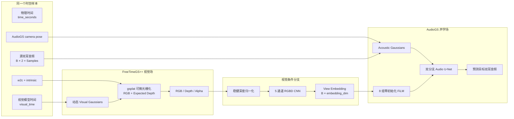
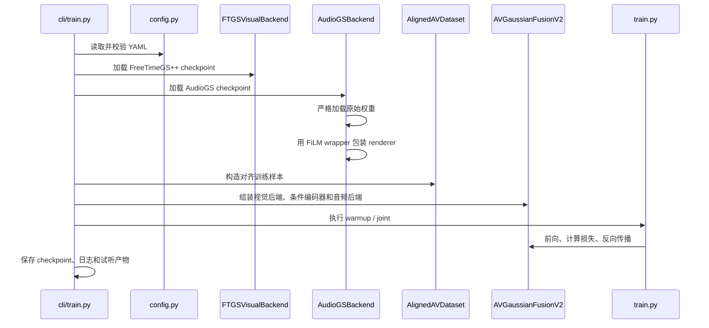
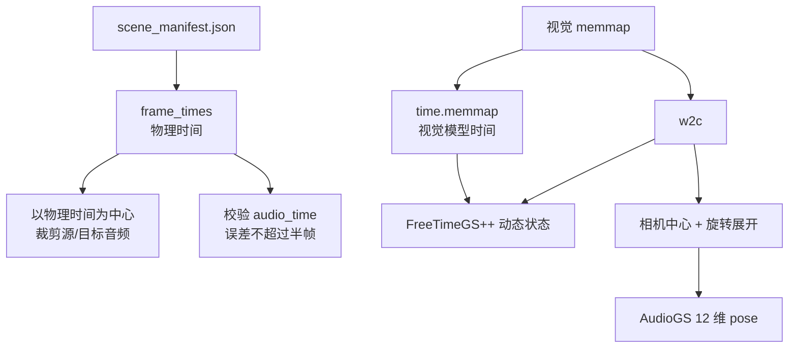
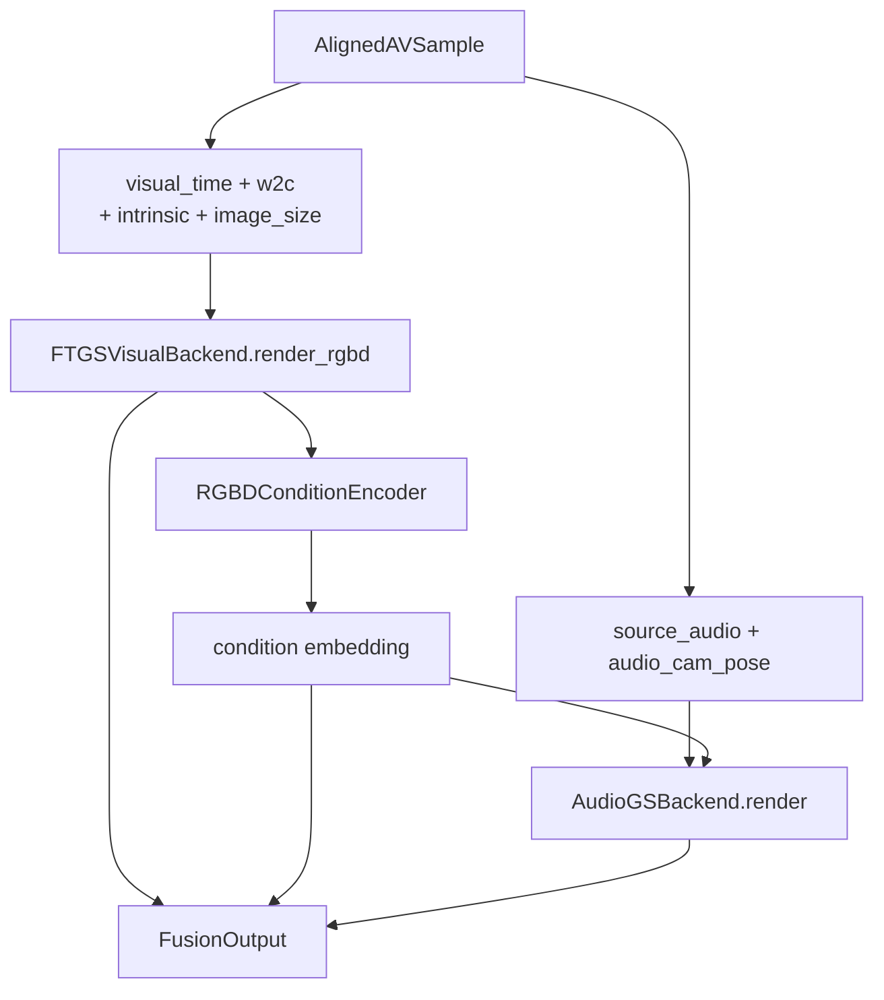
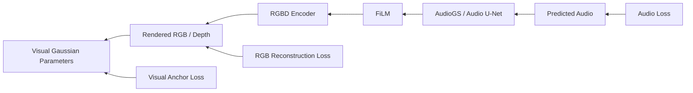

# AVGaussianFusionV2 架构与代码导读

本文从代码实现角度解释 AVGaussianFusionV2 的整体目标、模块关系、数据流、训练流程、检查点格式和当前实现边界。设计规格可参考
[`superpowers/specs/2026-07-21-avgaussianfusion-v2-rgbd-conditioned-audio-design.md`](superpowers/specs/2026-07-21-avgaussianfusion-v2-rgbd-conditioned-audio-design.md)；
本文更关注“代码实际如何运行”。

## 1. 核心思想

AVGaussianFusionV2 同时使用两个独立的预训练 Gaussian 场：

- **FreeTimeGS++** 表示动态视觉场，负责在指定时间和相机下渲染 RGB、期望深度和 Alpha。
- **AudioGS Replay** 表示声学场，负责从源双耳音频和目标相机位姿生成目标双耳音频。

二者不共享 Gaussian 参数，不要求视觉点和声学点一一对应，也不在数据结构层面合并。它们唯一的耦合是渲染时的单向可微条件路径：

```text
Visual Gaussians
    → target-view RGB/depth/alpha
    → RGBD condition encoder
    → view embedding
    → FiLM-conditioned AudioGS U-Net
    → predicted binaural audio
```

因此，“Fusion”指的是视觉信息对音频渲染的条件化，而不是两个 Gaussian 场的几何融合。

## 2. 整体架构



当前版本只有视觉到音频的条件路径，没有音频到视觉的反向条件输入。

## 3. 代码目录与职责

```text
avgaussianv2/
├── config.py                     # YAML 配置解析与严格校验
├── contracts.py                  # 模块之间共享的数据结构
├── backends/
│   ├── visual_ftgspp.py          # FreeTimeGS++ 加载和 RGBD 渲染适配
│   └── audio_audiogs.py          # AudioGS 加载、损失和条件渲染适配
├── data/
│   └── aligned.py                # 音视频时间、相机和监督数据对齐
├── models/
│   ├── rgbd.py                   # 深度归一化与 RGBD 条件编码器
│   ├── film_unet.py              # FiLM 条件化 AudioGS U-Net
│   └── fusion.py                 # 顶层融合模型
├── losses.py                     # 联合训练损失
├── train.py                      # Warmup、联合训练与梯度诊断
├── checkpoint.py                 # 版本化保存、兼容性检查与恢复
└── cli/
    └── train.py                  # 训练命令入口、模块组装和产物写出
```

各层之间通过 `contracts.py` 中的三个数据结构通信：

- `RGBDRender`：`rgb`、`depth`、`alpha`。
- `AlignedAVSample`：一个完成时间和相机对齐的训练或评估样本。
- `FusionOutput`：RGBD 渲染、条件向量和预测音频。

## 4. 从命令到训练

典型命令如下：

```bash
uv run python -m avgaussianv2.cli.train \
  --config configs/scene1_opera.yaml \
  --output-dir runs/scene1_opera \
  --stage all
```

入口是 `avgaussianv2.cli.train.main()`，主要调用关系如下：



`_default_backend_factory()` 完成默认模型组装：

1. `FTGSVisualBackend.load()` 加载视觉 checkpoint。
2. `AudioGSBackend.load()` 加载音频 checkpoint。
3. 创建 `RGBDConditionEncoder`。
4. 将三者放入 `AVGaussianFusionV2`。
5. 创建 `AlignedAVDataset(split="train")`。
6. 根据 AudioGS checkpoint 原始配置创建对应 criterion。

## 5. 配置系统

`config.py` 将 YAML 转换为四组不可变 dataclass：

| 配置 | 作用 |
|---|---|
| `SceneConfig` | 场景 ID、帧率、训练/评估相机和相机索引映射 |
| `PathConfig` | 两个上游仓库、两个 checkpoint、manifest 和视觉 memmap |
| `ModelConfig` | embedding、STFT、采样率和条件图像分辨率 |
| `TrainConfig` | 音频裁剪、阶段步数、学习率、损失权重和梯度探测策略 |

配置验证会拒绝缺失的 checkpoint 路径字段、非正数尺寸和采样参数、无效 Alpha 阈值，以及缺少相机映射等情况。

仓库提供两个场景配置：

- `configs/scene1_opera.yaml`
- `configs/Scene7playing.yaml`

两者使用相同模型结构和训练参数，主要区别是场景 ID、上游 checkpoint、manifest 和 memmap 路径。

## 6. 音视频数据对齐

`AlignedAVDataset` 同时读取：

- 场景 manifest；
- 视觉 `rgb/w2c/intrinsic/time` memmap；
- 源双耳 WAV；
- 每个目标相机的双耳 WAV。

### 6.1 两种时间

代码明确区分：

- `time_seconds`：真实物理时间，用于在 WAV 中定位裁剪中心。
- `visual_time`：FreeTimeGS++ 存储在 memmap 中的模型归一化时间。

不能直接用 `time_seconds` 替代 `visual_time`，因为上游动态视觉模型可能使用不同的时间参数化。



### 6.2 对齐约束

数据集会检查：

- manifest 场景 ID 与配置一致；
- manifest 采样率与模型配置一致；
- 所有请求相机都有配置映射和 manifest 记录；
- `frame_times` 与 `audio_times` 数量相同；
- 音视频中心时间误差不超过 `0.5 / fps`；
- 相机索引没有超出 memmap 相机维度；
- WAV 是配置采样率的双通道音频。

需要在音频边界外补零的窗口不会进入样本列表。RGB 调整到条件分辨率时，相机内参也会同步缩放。

### 6.3 同一相机的两种表示

视觉后端直接使用 `w2c` 和 `intrinsic`。AudioGS 位姿则从同一个 `w2c` 计算：

```text
camera_center = -Rᵀ t
audio_pose = concat(camera_center, flatten(R))
```

这样视觉条件与音频目标始终对应同一个观察位置。

## 7. 视觉 Gaussian 后端

`FTGSVisualBackend` 是 FreeTimeGS++ 与核心融合代码之间的适配层。

加载时要求 checkpoint 对象具备：

- `means_t`
- `opacities_t`
- `means`
- `quats`
- `scales`
- `sh_0`
- `sh_n`
- `sh_degree`

渲染时调用 `gsplat.rasterization(..., render_mode="RGB+ED")`，一次获得 RGB、Expected Depth 和 Alpha。一次调用中的 RGB 与深度共享：

- 动态 Gaussian 状态；
- 视觉模型时间；
- 相机外参；
- 相机内参；
- 图像尺寸。

输出张量形状为：

```text
rgb:   (B, H, W, 3)
depth: (B, H, W, 1)
alpha: (B, H, W, 1)
```

这条路径不执行 `detach`，因此联合训练的音频损失可以通过 RGBD 条件返回视觉 Gaussian 参数。

## 8. RGBD 条件编码

`RGBDConditionEncoder` 使用五通道输入：

```text
RGB 三通道
+ 稳健归一化深度一通道
+ 有效深度 Mask 一通道
= 五通道
```

### 8.1 深度归一化

`normalize_depth()` 的处理步骤是：

1. 使用 Alpha 阈值、有限性和正深度判断有效像素。
2. 对有效深度执行 `log1p`。
3. 计算每张图有效像素的中位数。
4. 使用中位绝对偏差进行尺度归一化。
5. 将无效位置设为零。

这种方法比全局均值和标准差更不易受背景、远处深度和异常值影响。

### 8.2 编码器结构

```text
5 channels
  → Conv block 32, stride 2
  → Conv block 64, stride 2
  → Conv block 128, stride 2
  → AdaptiveAvgPool2d(1)
  → Linear(128, embedding_dim)
```

默认输出形状为 `(B, 128)`。

## 9. AudioGS 后端与 FiLM

`AudioGSBackend` 隔离所有上游 AudioGS 特定逻辑，包括：

- 根据模型类定位上游实现；
- 使用 checkpoint 中的原始 YACS `cfg` 重建模型；
- 严格加载 `model_state_dict`；
- 根据 `cfg.model.file` 重建与上游 trainer 相同的 criterion；
- 用 `FiLMConditionedAudioUNet` 包装原始 renderer；
- 对 GS-only 模型提供兼容桥接。

### 9.1 严格加载

音频 checkpoint 必须包含：

- `model_state_dict`
- 用于重建模型和 criterion 的 `cfg`

除静态 STFT cache 外，所有权重严格匹配。静态 cache 会使用当前模型初始化时的形状，以适配不同裁剪长度。

### 9.2 FiLM 计算

每个 FiLM 模块根据视角向量产生通道级 scale 和 shift：

```text
scale, shift = Linear(condition)
output = value × (1 + scale) + shift
```

FiLM 注入 Audio U-Net 的八个位置：

```text
Encoder: e1, e2, e3, e4
Decoder: d4, d3, d2, d1
```

所有 FiLM 线性层采用全零初始化，因此初始化时：

```text
scale = 0
shift = 0
FiLM(value) = value
```

新增条件路径在训练开始时不会改变原始 AudioGS 输出。

### 9.3 双分支 U-Net

AudioGS U-Net 第一层包含两个分支：

- Mono/content 分支：`enc1`
- Difference/spatial 分支：`diff_enc1`

两个分支池化后取平均，随后进入共享编码器和带跳连的解码器。最终生成：

- 正值 `mono_mask`
- `[-1, 1]` 范围的 `diff_mask`

FiLM 调制主编码器和解码器层，差分分支第一层没有单独的 FiLM。

### 9.4 GS-only 模型桥接

当前场景配置使用 `Audio3DGSMonoDiffGSOnly`。该模型的原生前向可能绕过 U-Net，因此条件输出采用：

```text
native GS-only
+ conditioned inherited U-Net
- plain inherited U-Net
```

由此保证：

- 条件关闭时完全保留原生 GS-only 输出；
- FiLM 为零初始化时，条件和无条件 U-Net 相同，残差为零；
- FiLM 学到非零调制后，U-Net 只提供条件残差。

## 10. 顶层前向流程

`AVGaussianFusionV2.forward()` 是核心调用链：



当 `condition_enabled=False` 时，音频后端收到 `condition=None`。当前实现仍会计算 RGBD 和 embedding，只是不把 embedding 注入 AudioGS。

## 11. 两阶段训练

### 11.1 Condition warmup

Warmup 阶段冻结：

- Visual Gaussians
- Acoustic 参数
- 原始 Audio U-Net

只训练：

- RGBD condition encoder
- FiLM adapters

该阶段只计算 AudioGS 音频损失。目标是先让新增条件路径学到有效调制，避免训练一开始就扰动两个预训练场。

### 11.2 Joint fine-tuning

联合训练解冻所有参数，并按参数组设置学习率：

| 参数组 | 默认学习率 |
|---|---:|
| Visual Gaussians | `1e-5` |
| Acoustic parameters | `1e-4` |
| Audio U-Net | `1e-4` |
| RGBD encoder | `1e-4` |
| FiLM | `1e-4` |

联合损失为：

```text
L =
  λ_audio × L_AudioGS
  + λ_rgb × (L1_RGB + λ_dssim × DSSIM)
  + λ_anchor × L_visual_anchor
```

其中：

- `L_AudioGS` 使用上游 AudioGS 对应的 criterion。
- RGB 重建损失约束视觉场继续生成正确图像。
- Visual anchor 约束视觉参数不要偏离联合训练开始时的快照。

### 11.3 梯度方向



联合训练会单独调用：

```python
torch.autograd.grad(audio_loss, visual_parameters)
```

这用于测量“只由音频损失产生的视觉梯度”。如果该梯度连续多次为零，训练抛出 `DisconnectedAudioVisualGradient`，防止程序表面正常运行但视觉条件链路实际已经断开。

### 11.4 参数冻结关系

| 阶段 | Visual | Acoustic | Audio U-Net | RGBD Encoder | FiLM |
|---|---:|---:|---:|---:|---:|
| Warmup | 冻结 | 冻结 | 冻结 | 训练 | 训练 |
| Joint | 训练 | 训练 | 训练 | 训练 | 训练 |

## 12. Condition-off 消融

CLI 支持 joint-only 的条件关闭实验：

```bash
uv run python -m avgaussianv2.cli.train \
  --config configs/scene1_opera.yaml \
  --output-dir runs/scene1_opera_condition_off \
  --stage joint \
  --condition-off
```

该模式：

- 将 `model.condition_enabled` 设为 `False`；
- 不要求音频损失产生视觉梯度；
- 仍在产物阶段分别生成 condition-on 和 condition-off 音频；
- 计算两者平均绝对差 `condition_delta_mean_abs`。

Condition-off 不允许与 warmup 一起运行，因为 warmup 的唯一目标就是训练条件路径。

## 13. Checkpoint

融合 checkpoint 使用版本化 Schema，分别保存：

- Visual backend state；
- AudioGS backend state；
- RGBD condition encoder state；
- FiLM state；
- 可选 optimizer state；
- 完整解析后的配置；
- 上游 checkpoint 来源；
- 当前阶段、步数和 loss history；
- 实验兼容性信息。

兼容性信息包括：

- 场景 ID；
- 相机映射哈希；
- embedding 维度；
- STFT 参数；
- 采样率；
- AudioGS 模型类。

加载时任何不兼容都会在写入模型前失败。保存过程先写临时文件，再通过 `os.replace()` 原子替换目标文件，降低中途失败造成 checkpoint 损坏的风险。

## 14. 运行产物

每次 CLI 训练会写出：

```text
output_dir/
├── checkpoint_latest.pt
├── resolved_config.json
├── loss_history.json
├── gradient_norms.json
├── selected_sample.json
├── run_summary.json
└── artifacts/
    ├── sample_pred.wav
    ├── sample_condition_on.wav
    ├── sample_condition_off.wav
    ├── sample_rgb.ppm
    ├── sample_depth.pgm
    └── metrics.json
```

这些文件分别记录：

- 实验配置和上游来源；
- 每步分项损失；
- 每个参数组的梯度范数；
- 音频损失到视觉参数的梯度范数；
- 被选中生成预览的样本身份；
- RGB、深度和 condition-on/off 音频；
- 条件开启与关闭的输出差异。

## 15. 测试覆盖

仓库测试覆盖以下关键行为：

- FreeTimeGS++ RGBD 渲染形状和可微性；
- 深度背景 Mask 和稳健归一化；
- FiLM 零初始化与基础 U-Net 输出一致；
- 条件上下文在异常后正确清理；
- AudioGS checkpoint 严格加载；
- GS-only 条件残差桥接；
- 音频损失能够回传视觉参数；
- 数据集物理时间与视觉时间分离；
- 同一个 `w2c` 同时生成视觉相机和 AudioGS pose；
- 音频边界窗口过滤；
- Warmup 只更新 condition encoder 和 FiLM；
- 联合损失、梯度统计和非有限值诊断；
- Checkpoint 往返恢复和兼容性拒绝；
- CPU 假后端端到端 smoke 流程及产物生成。

真实 checkpoint smoke 脚本位于：

- `scripts/smoke_scene1_opera.sh`
- `scripts/smoke_Scene7playing.sh`

## 16. 当前实现边界

当前代码适合验证融合路径和进行短程训练，但仍有以下边界：

1. 只有训练 CLI，没有独立的批量推理或定量评估 CLI。
2. 数据集支持 `eval` split，但默认训练入口只创建 `train` split。
3. `checkpoint.py` 支持恢复，CLI 尚未提供 `--resume` 参数。
4. CLI 最终保存 checkpoint 时没有保存 optimizer state，因此不能完整恢复优化器动量。
5. 数据样本自身带 batch 维度，训练循环没有使用 `DataLoader` 做批处理或并行加载。
6. 真实运行依赖配置中机器特定的上游仓库、数据、checkpoint 和 CUDA `gsplat`。
7. 当前只有视觉到音频的单向条件化。
8. 初始里程碑主要验证可微链路和 smoke training，不表示模型已经充分收敛或超过无条件基线。

## 17. 推荐阅读顺序

第一次阅读代码时，推荐按以下顺序：

1. `avgaussianv2/contracts.py`：了解模块间数据形状。
2. `avgaussianv2/models/fusion.py`：掌握最短前向主链。
3. `avgaussianv2/data/aligned.py`：理解时间和相机对齐。
4. `avgaussianv2/backends/visual_ftgspp.py`：理解 RGBD 如何产生。
5. `avgaussianv2/models/rgbd.py`：理解视觉条件如何编码。
6. `avgaussianv2/models/film_unet.py`：理解条件如何进入 Audio U-Net。
7. `avgaussianv2/backends/audio_audiogs.py`：理解上游 AudioGS 兼容层。
8. `avgaussianv2/losses.py` 和 `avgaussianv2/train.py`：理解两阶段优化和梯度诊断。
9. `avgaussianv2/cli/train.py`：理解完整组装和运行产物。
10. `tests/`：通过小模型确认每个关键设计约束。

## 18. 一句话总结

AVGaussianFusionV2 是一个边界清晰的视觉条件声学渲染系统：它保留 FreeTimeGS++ 和 AudioGS 两个独立预训练 Gaussian 场，用同一时间和相机下的可微 RGBD 渲染生成视角 embedding，再通过零初始化、多尺度 FiLM 调制 AudioGS U-Net，并通过分阶段训练、视觉重建约束和显式梯度探测保证这条视觉到音频的融合路径真实有效。
