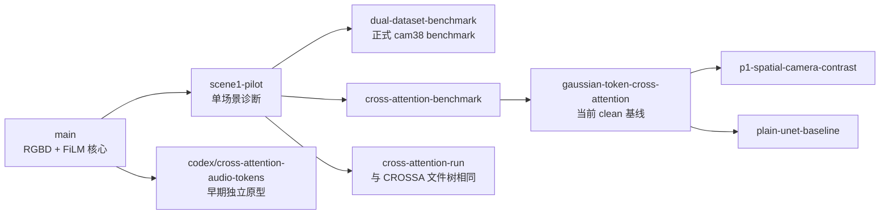
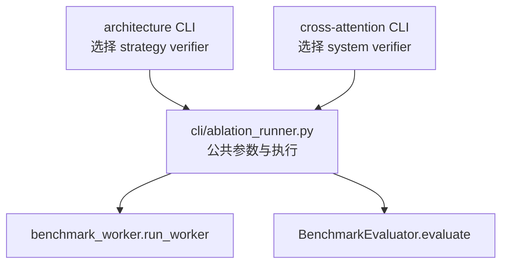

# AVGaussianV2 代码结构与分支导读

本文基于 2026-07-30 刷新的远端引用，解释当前分支分别解决什么问题、它们之间的
真实关系，以及阅读代码时如何避开实验编排层的大量跳转。

当前整理分支为 `clean/codebase-structure`，基线是
`origin/agent/gaussian-token-cross-attention`。当前主线保留核心模型、正式
cam38 benchmark、cross-attention 和显式 AudioGS Gaussian token。早期 Scene1
pilot 已从主线退役，完整实现仍保留在 `origin/agent/scene1-pilot` 的 Git 历史中。

## 1. 先看结论

仓库中的分支不是多套完全独立的项目，而是四层能力逐步叠加：

1. `main`：最小可训练的 RGBD-conditioned AudioGS 核心。
2. `scene1-pilot`：单场景快速诊断和可恢复实验。
3. `dual-dataset-benchmark` 一族：双场景、cam38 holdout、固定预算正式评测。
4. `cross-attention`、Gaussian token、P1、plain U-Net：在同一评测协议上的模型消融。

真正需要并排比较的是最后一层的模型假设，不是把所有分支机械 merge 成一个模型。
P1、spatial loss 和 plain U-Net 会修改相同的配置、runtime、训练和评估分派代码，
直接合并会把互斥实验的语义混在一起。

## 2. Git 真实拓扑

下面只画祖先关系，不把“功能相似”误画成 Git 继承：



需要特别注意：

- `cross-attention-benchmark` 与 `cross-attention-run` 的 commit hash 不同，但
  tree hash 都是 `73a16e8...`，代码内容完全一致，只是提交历史不同。
- `dual-dataset-benchmark` 是正式 benchmark 的一个终点；cross-attention 分支
  包含同类 benchmark 能力，但其 tip 不是 dual 分支 tip 的 Git 后代。
- `codex/cross-attention-audio-tokens` 从 `main` 独立出发，是早期模型原型和文档，
  不是后来正式 cross-attention benchmark 的祖先。
- `p1-spatial-camera-contrast` 与 `plain-unet-baseline` 是从 Gaussian-token 基线
  分出的并行实验。二者都继续扩充了共享分派层，但研究问题不同。

## 3. 分支用途矩阵

| 分支 | 它回答的问题 | 主要新增能力 | 建议 |
|---|---|---|---|
| `main` | RGBD 能否可微地条件化 AudioGS？ | FTGS++ RGBD、condition encoder、FiLM U-Net、warmup/joint | 读核心模型时从这里理解 |
| `agent/rgbd-conditioning` | 最初的 RGBD conditioning 实现 | 已 merge 到 `main` | 不必单独维护 |
| `agent/scene1-pilot` | 这条链路是否值得做长训练？ | 三变体 worker、quick/full eval、早停、resume、报告 | 理解探索性实验 |
| `agent/dual-dataset-benchmark` | 如何做无 cam38 泄漏的正式比较？ | 两场景、native contract、30k fixed budget、证据审计 | 理解评测协议 |
| `agent/cross-attention-benchmark` | cross-attention 是否优于 FiLM？ | source-STFT query、RGBD memory、因果消融、诊断 | 正式 cross-attention 基线 |
| `agent/cross-attention-run` | 同上 | 文件树与上一分支完全相同 | 可归档，不应重复比较 |
| `agent/gaussian-token-cross-attention` | 显式 AudioGS Gaussian 属性是否有帮助？ | Gaussian/pose token、native GS residual anchor | clean 分支的共同基线 |
| `agent/p1-spatial-camera-contrast` | 几何对应和空间音频约束能否增强相机因果性？ | mask cross-attention、query-dependent P1、spatial loss | 独立候选实验 |
| `agent/plain-unet-baseline` | 无视觉 plain U-Net 是否缺失？ | strict plain U-Net、LRE anchor、实验汇总 | 独立对照实验 |
| `codex/cross-attention-audio-tokens` | token cross-attention 的早期结构是否可行？ | 独立原型和早期架构文档 | 只作历史参考 |

### 3.1 P1 分支

`p1-spatial-camera-contrast` 在 Gaussian-token 基线上又加入：

- AudioGS mask-protocol cross-attention；
- 带世界几何、相机射线和监听者坐标的 query-dependent P1；
- correct camera / no RGBD / wrong camera 因果评估；
- LRE、ILD、IPD、双耳 difference 组成的 spatial auxiliary loss。

已提交结果显示 spatial loss 在 5k 有局部收益，但 30k 时两个场景的主音频损失和
LRE 都没有稳定优于原 P1，因此它是一个实验结论，不是应直接合入基线的默认目标。

### 3.2 Plain U-Net 分支

`plain-unet-baseline` 补齐此前实验矩阵中的缺口：原 `audio_only` 实际是
AudioGS GS-only continuation，并不等于“AudioGS + 无视觉 U-Net”。该分支增加
strict plain U-Net baseline 和 native LRE anchoring，用于把以下因素拆开：

```text
AudioGS Gaussian 本体
    vs
无视觉 U-Net
    vs
RGBD + FiLM U-Net
    vs
cross-attention / P1
```

这个分支适合作为对照实验保留，不应与 P1 spatial objective 混成一个默认模型。

## 4. 四层代码地图

### 4.1 Core model：模型到底如何前向

核心路径规模较小，也是理解项目的起点：

```mermaid
flowchart LR
    CFG["config.py"] --> DATA["data/aligned.py"]
    DATA --> SAMPLE["AlignedAVSample"]
    SAMPLE --> FUSION["models/fusion.py"]
    FUSION --> VIS["backends/visual_ftgspp.py"]
    VIS --> RGBD["RGBD render"]
    RGBD --> ENC["models/rgbd.py 或 visual_tokens.py"]
    ENC --> AUDIO["audio_audiogs.py 或 cross_attention_audio.py"]
    AUDIO --> OUT["FusionOutput"]
    OUT --> LOSS["losses.py"]
    LOSS --> TRAIN["train.py"]
```



关键边界：

- `contracts.py`：跨模块的数据形状，不包含实验协议。
- `data/aligned.py`：把物理音频时间、视觉模型时间和相机统一成样本。
- `models/fusion.py`：核心前向只有“视觉渲染 -> 条件编码 -> 音频渲染”。
- `runtime.py`：根据 `model.audio_backend` 选择具体音频和条件编码器。
- `train.py`：warmup/joint 的冻结、optimizer 和单步损失。

### 4.2 Archived pilot：历史快速诊断

`origin/agent/scene1-pilot` 曾实现单场景三变体、quick validation、早停和
checkpoint/report 状态机。正式 cam38 benchmark 已覆盖这些生产需求，且仓库没有
提交 pilot 正式结果，因此当前 clean 主线不再携带该工作流。需要复盘历史设计时，
查看该分支和 `docs/superpowers/` 下的原始 spec/plan。

### 4.3 Benchmark：正式协议和证据

`avgaussianv2/benchmark/` 负责 cam00-cam37 训练、cam38 测试的正式协议：

| 文件 | 读它是为了理解 |
|---|---|
| `assets.py` | 输入资产、split 和上游缓存为何可信 |
| `runtime.py` | benchmark 如何构造模型与 train/eval data |
| `training.py` | 固定预算、milestone、resume 和训练证据 |
| `evaluation.py` | checkpoint 如何在 cam38 上统一评估 |
| `report.py` | scene/suite 指标如何聚合 |
| `production.py` | pinned input、模型分派和 evaluator adapter |
| `orchestration.py` | 多进程和多 GPU 阶段如何串联 |

这里的大量代码用于防止数据泄漏、错误 resume、产物冒充完成和环境漂移。它们提高
实验可信度，但不是模型算法本身。

### 4.4 Ablation：只描述模型差异

模型消融集中在：

- `benchmark/architecture_ablation.py`：FiLM residual、direct U-Net、
  gated residual 等输出结构；
- `benchmark/cross_attention_ablation.py`：cross-attention 训练和因果条件；
- `models/audio_tokens.py`、`cross_attention_audio.py`：音频 token 路线；
- `models/acoustic_gaussian_tokens.py`：显式 AudioGS Gaussian 属性和 pose token。

`cli/ablation_runner.py` 是 clean 分支新增的共享执行层。原有
`benchmark_architecture_*` 和 `benchmark_cross_attention_*` 命令仍存在，但
worker/evaluator 的重复流程已收敛：



## 5. 一次调用如何穿过代码

### 5.1 普通训练

```text
cli/train.py
  -> config.load_project_config
  -> runtime.build_runtime
       -> visual backend
       -> audio backend
       -> condition encoder
       -> aligned train/eval dataset
  -> train.run_condition_warmup
  -> train.run_joint_finetune
  -> checkpoint + artifacts
```

### 5.2 正式 benchmark

```text
cli/benchmark_suite.py
  -> benchmark/orchestration.py
       -> native baseline preparation/contracts
       -> production preparation
       -> cli/benchmark_worker.py
            -> benchmark/training.py
       -> cli/benchmark_eval.py
            -> benchmark/evaluation.py
       -> cli/benchmark_report.py
            -> benchmark/report.py
```

### 5.3 模型消融

```text
architecture/cross-attention compatibility CLI
  -> experiment-specific preparation verifier
  -> cli/ablation_runner.py
  -> common benchmark worker or evaluator
```

## 6. 推荐阅读顺序

想理解算法，不要先读两千行的 orchestrator。按下面顺序：

1. `avgaussianv2/contracts.py`
2. `avgaussianv2/models/fusion.py`
3. `avgaussianv2/data/aligned.py`
4. `avgaussianv2/runtime.py`
5. `avgaussianv2/backends/visual_ftgspp.py`
6. `avgaussianv2/backends/audio_audiogs.py`
7. `avgaussianv2/models/rgbd.py` 和 `models/film_unet.py`
8. `avgaussianv2/train.py` 和 `losses.py`
9. 研究 token 路线时再读 `audio_tokens.py`、`visual_tokens.py`、
   `acoustic_gaussian_tokens.py`、`cross_attention_audio.py`
10. 最后根据需要进入 `benchmark/`

## 7. 后续分支治理建议

建议把分支分为三类：

- **主干**：稳定的核心模型与共用 benchmark 协议；
- **候选模型**：P1、plain U-Net 等互斥实验，一条研究问题一个短分支；
- **已归档**：内容重复或已被后续吸收的分支。

当前可直接归档候选：

- `agent/rgbd-conditioning`：已被 `main` merge；
- `agent/cross-attention-run`：与 `cross-attention-benchmark` 文件树相同；
- `codex/hybrid-audiogs-gaussian-tokens`：与
  `codex/cross-attention-audio-tokens` 指向同一提交；
- 早期 `codex/cross-attention-audio-tokens`：保留 tag 或文档引用后归档。

不建议现在删除 `p1-spatial-camera-contrast` 或 `plain-unet-baseline`。应先把各自
可复用且已验证的模型能力以小提交移植到共同主干，再保留实验配置和结果作为独立记录。
