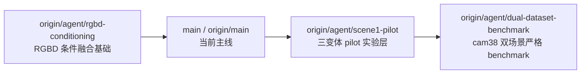
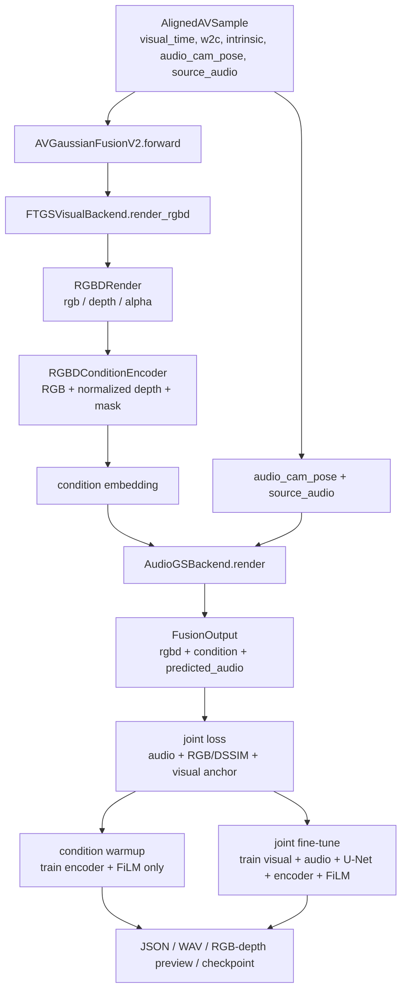
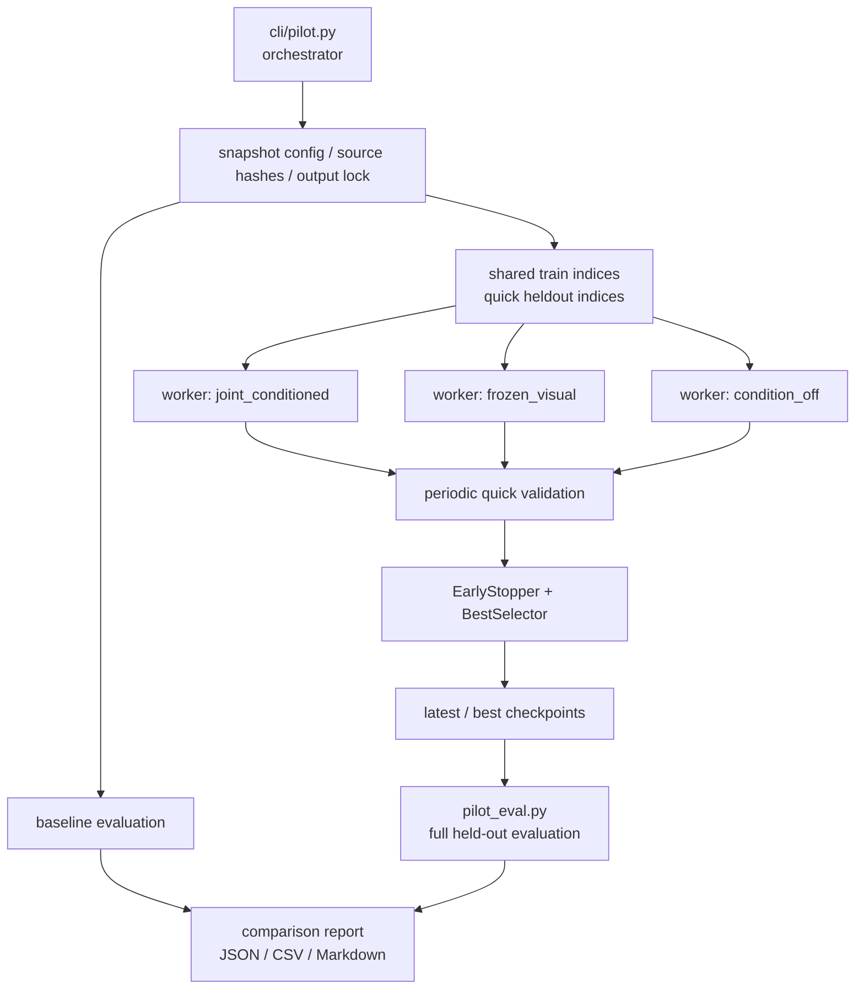
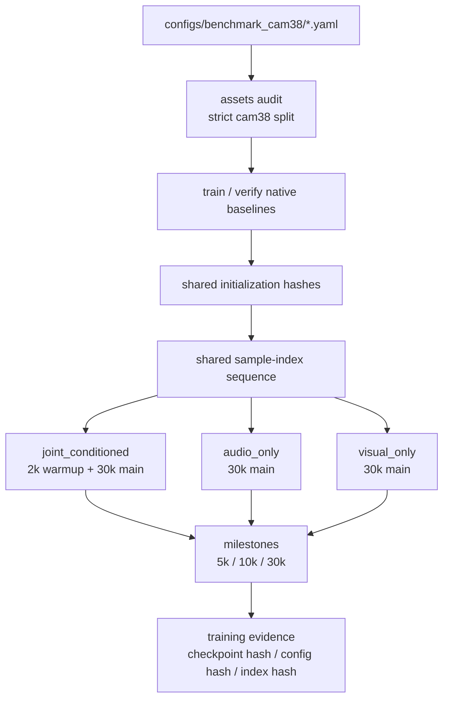
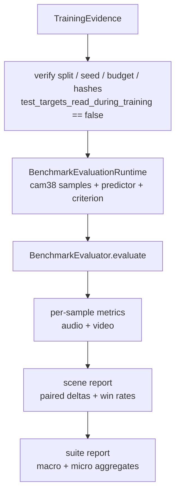
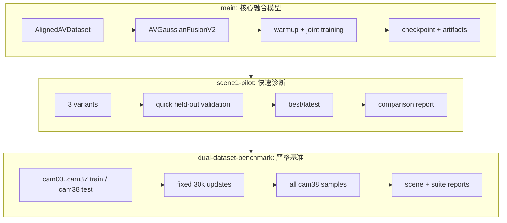

# AVGaussianV2 代码库与分支总览

本文总结 `/Users/bytedance/Documents/Code/AVGaussian/AVGaussianv2` 的当前代码结构、核心数据流，以及远端分支之间的关系。它偏向“快速建立全局理解”，更细的 `main` 主干代码导读可继续参考 [`architecture-and-code-walkthrough.zh-CN.md`](architecture-and-code-walkthrough.zh-CN.md)。

## 1. 分支关系

当前本地工作树在 `main`，它已经合入 `origin/agent/rgbd-conditioning`。另外两个主要远端分支是在主线之上继续扩展：



| 分支 | 作用 | 与上一层关系 |
|---|---|---|
| `main` | 核心 AVGaussianFusionV2 训练与 smoke pipeline | 已合入 RGBD conditioning 基础实现 |
| `origin/agent/scene1-pilot` | 在 `scene1_opera` 上做快速诊断实验 | 添加实验 orchestration、三变体训练、评估、早停和报告 |
| `origin/agent/dual-dataset-benchmark` | 在两个场景上做严格 cam38 holdout benchmark | 继承 pilot，再添加固定预算训练、native baseline、cam38 审计、suite report |

## 2. 主线核心思想

`main` 的模型并不是把视觉 Gaussian 和音频 Gaussian 合并成一个统一 Gaussian 场，而是保留两个独立的预训练后端：

- **FreeTimeGS++**：动态视觉场，按时间和相机渲染 RGB、深度和 Alpha。
- **AudioGS Replay**：声学场，从源双耳音频和目标相机位姿预测目标双耳音频。

二者通过一条可微条件路径连接：视觉后端渲染目标视角 RGBD，`RGBDConditionEncoder` 将 RGB、稳健归一化深度和 Alpha mask 编成条件向量，FiLM adapter 再把条件向量注入 AudioGS U-Net。



## 3. 主线模块职责

| 模块 | 职责 | 关键文件 |
|---|---|---|
| 配置 | 解析 YAML，拆分为 scene、paths、model、train 四块并校验 | `avgaussianv2/config.py` |
| 数据契约 | 定义跨模块张量结构：`RGBDRender`、`AlignedAVSample`、`FusionOutput` | `avgaussianv2/contracts.py` |
| 对齐数据集 | 从 manifest、visual memmap、源/目标 WAV 构造同一时间同一相机的监督样本 | `avgaussianv2/data/aligned.py` |
| 视觉后端 | 加载 FreeTimeGS++ checkpoint，调用 `gsplat.rasterization(..., render_mode="RGB+ED")` | `avgaussianv2/backends/visual_ftgspp.py` |
| 音频后端 | 加载 AudioGS checkpoint，严格恢复权重，包装 FiLM U-Net，重建原始 criterion | `avgaussianv2/backends/audio_audiogs.py` |
| 条件编码 | 将 RGB、归一化 depth、valid mask 编为固定维度 embedding | `avgaussianv2/models/rgbd.py` |
| FiLM U-Net | 在 AudioGS U-Net 的 encoder/decoder 多尺度 block 上注入条件 | `avgaussianv2/models/film_unet.py` |
| 融合模型 | 串联视觉渲染、条件编码和音频渲染，并提供参数分组 | `avgaussianv2/models/fusion.py` |
| 损失 | 组合 AudioGS loss、RGB L1、DSSIM 和 visual anchor loss | `avgaussianv2/losses.py` |
| 训练 | warmup、joint fine-tune、非有限值检查、audio-to-visual 梯度诊断 | `avgaussianv2/train.py` |
| 检查点 | 保存 visual/audio/condition/FiLM 分离 state 与兼容性 fingerprint | `avgaussianv2/checkpoint.py` |
| CLI | `python -m avgaussianv2.cli.train`，组装 runtime、跑训练、写产物 | `avgaussianv2/cli/train.py` |

## 4. 主线端到端流程

1. 用户执行 `python -m avgaussianv2.cli.train --config ... --output-dir ... --stage ...`。
2. CLI 调 `load_project_config()` 读取场景、checkpoint、manifest、memmap、模型和训练参数。
3. 默认 backend factory 加载 FreeTimeGS++ 视觉 checkpoint 和 AudioGS checkpoint。
4. AudioGS 加载时先严格 `load_state_dict`，再把原 `renderer` 包成 `FiLMConditionedAudioUNet`。
5. `AlignedAVDataset` 读取视觉 memmap 的 `rgb/w2c/intrinsic/time`，并按物理时间裁剪源/目标双耳音频。
6. `AVGaussianFusionV2.forward()` 先渲染 RGBD，再编码 condition，最后把 condition 传给 AudioGS 渲染目标双耳音频。
7. warmup 阶段冻结预训练 visual/audio/base U-Net，只训练 `RGBDConditionEncoder` 和 FiLM。
8. joint 阶段全部解冻，联合优化音频、RGB/DSSIM 和 visual anchor，并检查 audio loss 是否能反传到 visual 参数。
9. 训练结束写出 `resolved_config.json`、`loss_history.json`、`gradient_norms.json`、`selected_sample.json`、`run_summary.json`、`checkpoint_latest.pt` 和 `artifacts/` 下的 WAV、RGB/depth preview、metrics。

## 5. 关键数据结构

### 5.1 `RGBDRender`

视觉后端输出：

```text
rgb:   (B, H, W, 3)
depth: (B, H, W, 1)
alpha: (B, H, W, 1)
```

### 5.2 `AlignedAVSample`

一个训练/评估样本包含：

- `scene_id`、`camera`、`frame_index`、`time_seconds`；
- `visual_time`：FreeTimeGS++ 使用的模型时间；
- `w2c`、`intrinsic`：视觉渲染使用的相机参数；
- `audio_cam_pose`：从同一个 `w2c` 转换得到的 AudioGS pose；
- `source_audio`、`target_audio`：双通道音频 crop；
- `target_rgb`：视觉监督目标。

### 5.3 `FusionOutput`

融合模型输出：

- `rgbd`：视觉渲染结果；
- `condition`：RGBD condition embedding；
- `predicted_audio`：AudioGS 条件渲染结果。

## 6. `origin/agent/scene1-pilot` 分支

该分支用于在 `scene1_opera` 上做一个较快的诊断实验，回答三个问题：

1. RGBD conditioning 是否改善 held-out 音频；
2. audio loss 是否值得更新 visual Gaussians；
3. 音频改善是否伴随不可接受的视觉质量退化。

### 6.1 新增模块

| 模块 | 职责 |
|---|---|
| `avgaussianv2/runtime.py` | 把主线 CLI 内的 backend/runtime 构建抽成公共边界，并显式要求信任上游 artifact |
| `avgaussianv2/experiment/contracts.py` | 定义 `Variant`、`PilotConfig`、shared indices 和 evaluation result |
| `avgaussianv2/experiment/training.py` | `PilotTrainer`，执行 variant-aware warmup/joint、周期验证、早停、best/latest checkpoint |
| `avgaussianv2/experiment/evaluation.py` | `Evaluator`，在 held-out split 上计算音频和视觉指标 |
| `avgaussianv2/experiment/selection.py` | `EarlyStopper` 和 `BestSelector` |
| `avgaussianv2/experiment/checkpoint.py` | 更严格的 pilot resume/checkpoint store |
| `avgaussianv2/experiment/report.py` | 组合 baseline 和变体评估结果，输出 JSON/CSV/Markdown |
| `avgaussianv2/cli/pilot.py` | orchestrator，创建 manifest、启动 worker、收集评估和报告 |
| `avgaussianv2/cli/pilot_worker.py` | 单个 GPU/variant worker |
| `avgaussianv2/cli/pilot_eval.py` | 最终 full-split evaluation |

### 6.2 三个受控变体

| Variant | Warmup | Joint | Condition | Visual 更新 | Audio 更新 |
|---|---:|---:|---|---|---|
| `joint_conditioned` | 有 | 有 | 开 | 开 | 开 |
| `frozen_visual` | 有 | 有 | 开 | 关 | 开 |
| `condition_off` | 无 | 有 | 关 | 关 | 开 |

`condition_off` 没有 warmup，因为关闭 condition 后 warmup 的梯度路径不存在。`frozen_visual` 用来隔离“只继续训练 AudioGS + condition”与“允许视觉载体一起被音频 loss 更新”的差别。

### 6.3 Pilot 流程图



### 6.4 Pilot 的设计重点

- 所有变体共享同一随机训练 index 序列和 held-out subset。
- 快速验证使用固定数量、均匀分布的 held-out samples。
- best checkpoint 的选择要求音频指标更好，同时视觉 PSNR/SSIM 不超过容忍退化。
- checkpoint/resume 不只是保存 tensor，还绑定配置、上游 checkpoint hash、index hash、optimizer identity 和训练历史。
- orchestrator 使用锁、配置快照和完整性校验，避免多个进程写坏同一输出目录。

## 7. `origin/agent/dual-dataset-benchmark` 分支

该分支继承 `scene1-pilot`，但目标从“快速诊断”升级为“严格正式 benchmark”。核心协议是：两个场景都只用 `cam00` 到 `cam37` 训练，`cam38` 作为唯一测试相机。

### 7.1 Benchmark 目标

- 场景：`scene1_opera` 和 `Scene7playing`。
- 训练相机：`cam00` ... `cam37`。
- 测试相机：`cam38`。
- 固定 seed：`42`。
- continuation 主训练预算：`30,000` updates。
- `joint_conditioned` 额外允许 `2,000` step conditioner warmup，但该 warmup 单独报告，不计入 modality update fairness。
- 预声明 reporting checkpoints：`5,000`、`10,000`、`30,000`。

### 7.2 新增模块

| 模块 | 职责 |
|---|---|
| `avgaussianv2/benchmark/assets.py` | cam38 protocol、资产/配置/上游缓存审计 |
| `avgaussianv2/benchmark/runtime.py` | benchmark runtime、输入快照、dataset/model/source identity |
| `avgaussianv2/benchmark/production.py` | 生产环境 pinned inputs、worker manifest、native/continuation evidence |
| `avgaussianv2/benchmark/training.py` | `FixedBudgetTrainer`，固定预算训练、resume、journal、milestone checkpoint |
| `avgaussianv2/benchmark/evaluation.py` | `BenchmarkEvaluator`，严格 evidence 验证和 cam38 全量评估 |
| `avgaussianv2/benchmark/report.py` | scene report 与 suite report 聚合 |
| `avgaussianv2/benchmark/orchestration.py` | 双场景 benchmark 编排 |
| `avgaussianv2/benchmark/native.py` | native AudioGS / FreeTimeGS++ 训练合同验证 |
| `avgaussianv2/benchmark/output.py` | 输出目录锁和安全读写 |
| `avgaussianv2/cli/benchmark_*.py` | prepare、scene、suite、worker、eval、report 等命令入口 |

### 7.3 对照系统

Benchmark 对比两类系统：

1. **Native baselines**
   - `native_audiogs`：cam38 holdout 的 AudioGS replay checkpoint。
   - `native_ftgspp`：cam38 holdout 的 FreeTimeGS++ checkpoint。
2. **Continuations**
   - `joint_conditioned`：从 native 初始化继续训练 audio、visual、condition encoder 和 FiLM。
   - `audio_only`：只更新 AudioGS acoustic/base U-Net，condition off，visual 冻结。
   - `visual_only`：只更新 FreeTimeGS++ visual carrier，condition off，audio 冻结。

### 7.4 Benchmark 训练流程



`FixedBudgetTrainer` 写入：

- `contract.json`：本次训练的固定协议；
- `progress.json`：轻量进度 journal；
- `checkpoint_io.json`：checkpoint I/O sidecar；
- `checkpoints/*.pt`：周期性完整 resume checkpoint；
- `milestones/step_005000.pt`、`step_010000.pt`、`step_030000.pt`；
- `final.pt`；
- `artifact_hashes.json` 和 `artifact_journal.json`。

### 7.5 Benchmark 评估与报告



评估要求：

- 每个系统使用完全相同的 cam38 sample IDs 和顺序。
- continuation 系统必须在 5k/10k/30k 都有报告。
- native 系统作为 descriptive references，不和 continuation 混成 update-matched 主结论。
- 音频指标包括 `audio_total`、mono/diff loss、waveform L1、mono/diff LSD、LRE error 等。
- 视频指标包括 RGB PSNR、SSIM、RGB L1；LPIPS 只有在所有相关系统都有相同实现和权重时才报告。
- exact RGB match 的 PSNR 会被 cap 到 100 dB，保证 JSON/CSV/报告都是有限数值。

### 7.6 Benchmark 对主线的关键修改

`dual-dataset-benchmark` 还改动了少量主线模块以支持严格 cam38 protocol：

- `avgaussianv2/data/aligned.py`：当 eval camera 不在训练 memmap 内时，从 held-out video 和 `cameras.npz` 读取 cam38 RGB 与校准，避免测试 RGB 进入训练 cache。
- `avgaussianv2/backends/audio_audiogs.py`：添加 deterministic STFT magnitude，并在构建 AudioGS criterion 时替换上游 `stft`，避免 CUDA reflection-pad backward 相关的不确定或不兼容行为。
- `pyproject.toml`：固定 Ruff 默认 lint 规则，避免工具升级导致 gate 变化。

## 8. 三层代码心智模型



最简理解：

- **`main`**：实现“视觉 RGBD 条件化 AudioGS”的可微训练链路。
- **`scene1-pilot`**：在一个场景上快速判断这条链路是否有效，并用三变体消融定位原因。
- **`dual-dataset-benchmark`**：把探索性 pilot 升级为严格、固定预算、可恢复、不可偷看测试目标的正式 benchmark。

## 9. 推荐阅读顺序

如果要继续深入代码，建议按以下顺序读：

1. `README.md`：项目目标、运行方式和上游依赖。
2. `avgaussianv2/contracts.py`：先掌握模块边界。
3. `avgaussianv2/data/aligned.py`：理解一个 sample 如何被构造。
4. `avgaussianv2/models/fusion.py`：理解 forward 主链路。
5. `avgaussianv2/models/rgbd.py` 与 `avgaussianv2/models/film_unet.py`：理解 condition 如何产生和注入。
6. `avgaussianv2/backends/visual_ftgspp.py` 与 `avgaussianv2/backends/audio_audiogs.py`：理解上游模型如何被适配。
7. `avgaussianv2/train.py` 与 `avgaussianv2/losses.py`：理解优化目标和冻结策略。
8. `avgaussianv2/cli/train.py`：理解实际训练命令如何组装 runtime 和产物。
9. 若看 pilot 分支，再读 `avgaussianv2/experiment/training.py`、`evaluation.py`、`report.py` 和 `cli/pilot.py`。
10. 若看 benchmark 分支，再读 `avgaussianv2/benchmark/training.py`、`evaluation.py`、`report.py`、`production.py` 和 `orchestration.py`。
