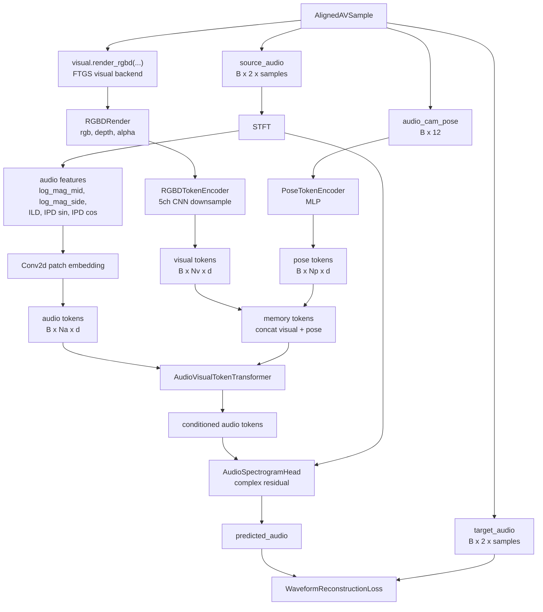
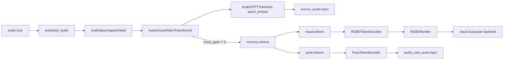

# Cross Attention Audio Token Backend 实现详解

本文详细说明 commit `ab665b1 feat: add cross-attention audio token backend` 引入的新音频后端路线。它的目标是替代当前实验中的“RGBD 全局 embedding + FiLM + Audio U-Net”条件方式，改成：

```text
source_audio -> STFT 空间音频特征 -> audio tokens
RGBD render  -> CNN downsample       -> visual tokens
camera pose  -> MLP                  -> pose tokens
audio tokens cross-attend visual/pose tokens -> spectrogram residual -> predicted_audio
```

这条路线的核心约束是：**不再沿用原 AudioGS renderer 中的 Audio U-Net**。旧的 AudioGS/FiLM 路线仍保留为默认配置，新路线通过 `model.audio_backend: cross_attention_tokens` 显式启用。

## 1. 背景与设计目标

此前路线：

```text
visual.render_rgbd
  -> RGBDConditionEncoder
  -> global embedding
  -> FiLM scale/shift
  -> AudioGS Audio U-Net
  -> predicted_audio
```

这个方案的优点是改动小，并且 zero-init FiLM 可以保护 pretrained AudioGS。但它有几个结构性问题：

- RGBD 被压缩成一个全局向量，空间结构和局部遮挡信息损失明显；
- FiLM 是全局调制，难以表达“某个频段/时间片应该关注哪块视觉区域”；
- 旧 Audio U-Net 是局部卷积时频结构，不天然支持 audio query 去检索 visual memory；
- 实验上容易出现主重建 loss 下降，但空间音频指标（例如 ILD/IPD/LRE）退化。

因此新路线的目标是：

- 保留“CNN 先降维 RGBD”的优点，但输出 spatial visual tokens，而不是 global embedding；
- 把双耳音频显式变成 STFT time-frequency tokens；
- 使用 gated cross attention，让 audio tokens 查询 visual/pose memory；
- 用 STFT 域空间音频损失约束 ILD/IPD/LRE；
- 通过零初始化 gate 保证新条件路径一开始是安全、可控的。

## 2. 文件与职责

| 文件 | 主要类/函数 | 职责 |
|---|---|---|
| `avgaussianv2/models/audio_tokens.py` | `AudioSTFTTokenizer` | 把 `B x 2 x samples` 双耳音频变成 `B x Na x d_model` audio tokens |
| `avgaussianv2/models/audio_tokens.py` | `AudioSpectrogramHead` | 把 transformer tokens 还原成 complex STFT residual，并 ISTFT 回 waveform |
| `avgaussianv2/models/visual_tokens.py` | `RGBDTokenEncoder` | 把 `RGB + normalized depth + mask` 编码成 spatial visual tokens |
| `avgaussianv2/models/visual_tokens.py` | `PoseTokenEncoder` | 把 `audio_cam_pose` 编码成少量 pose/geometry tokens |
| `avgaussianv2/models/cross_attention_audio.py` | `GatedCrossAttentionBlock` | gated self-attention、cross-attention、FFN block |
| `avgaussianv2/models/cross_attention_audio.py` | `AudioVisualTokenTransformer` | 堆叠多层 gated cross-attention block |
| `avgaussianv2/models/cross_attention_audio.py` | `AudioVisualTokenAudioBackend` | 对外暴露 `render(cam_pose, source_audio, condition)` 接口 |
| `avgaussianv2/models/cross_attention_audio.py` | `WaveformReconstructionLoss` | wave L1/MSE + ILD/IPD/LRE 空间损失 |
| `avgaussianv2/config.py` | `ModelConfig` | 新增 cross-attention backend 和 loss 权重配置 |
| `avgaussianv2/cli/train.py` | `_default_backend_factory` | 根据 `model.audio_backend` 选择旧 AudioGS 或新 token backend |
| `avgaussianv2/train.py` | `_optimizer_group` | 支持新 backend 没有 `audio_unet` 参数时跳过空 optimizer group |
| `tests/test_cross_attention_audio_tokens.py` | 单元测试 | 覆盖 shape、gate、梯度、criterion 和空间 loss |

## 3. 总体架构



## 4. Audio token 化

### 4.1 输入与 STFT

`AudioSTFTTokenizer` 接收：

```text
source_audio: B x 2 x samples
```

其中 channel 维固定为 2，对应 left/right 双耳信号。内部先用 `torch.stft(..., return_complex=True)` 得到：

```text
source_stft: B x 2 x F x T_stft
```

`AudioTokenBatch` 会保留 `source_stft` 和原始 waveform 长度，后续 `AudioSpectrogramHead` 需要用它做 residual prediction 和 ISTFT。

### 4.2 空间音频特征

tokenizer 不直接把 `L_real/L_imag/R_real/R_imag` 当输入，而是构造 5 个更贴近空间音频指标的通道：

| 通道 | 公式/含义 | 作用 |
|---|---|---|
| `log_mag_mid` | `log1p(abs((L + R) / 2))` | 主体响度和内容 |
| `log_mag_side` | `log1p(abs((L - R) / 2))` | 左右差异和空间宽度 |
| `ild` | `log(abs(L)+eps) - log(abs(R)+eps)` | interaural level difference |
| `ipd_sin` | `sin(angle(L) - angle(R))` 的等价复数表示 | 相位差，避免周期跳变 |
| `ipd_cos` | `cos(angle(L) - angle(R))` 的等价复数表示 | 相位差，避免周期跳变 |

输出特征形状：

```text
audio_features: B x 5 x F x T_stft
```

### 4.3 Patch embedding

为了避免 token 数过大，音频特征会先 pad 到 patch 网格，再通过二维卷积 patchify：

```text
Conv2d(
  in_channels=5,
  out_channels=d_model,
  kernel_size=(freq_patch, time_patch),
  stride=(freq_patch, time_patch),
)
```

得到：

```text
audio tokens: B x Na x d_model
Na = grid_freq * grid_time
```

默认建议：

```text
n_fft = 512
hop_length = 160
win_length = 400
audio_freq_patch = 16
audio_time_patch = 4
```

## 5. Visual / Pose token 化

### 5.1 RGBDTokenEncoder

`RGBDTokenEncoder` 接收 `RGBDRender`，内部先使用现有 `normalize_depth` 得到：

```text
normalized_depth: B x H x W x 1
valid_mask:       B x H x W x 1
```

再拼接为 5 通道：

```text
[rgb, normalized_depth, valid_mask]
shape: B x H x W x 5
```

随后转成 NCHW，通过多层 stride=2 CNN block 下采样，最后用 `1x1 Conv2d` 投影到 `d_model`：

```text
B x 5 x H x W
  -> CNN downsample
  -> B x d_model x Hv x Wv
  -> flatten
  -> B x Nv x d_model
```

这样保留了低分辨率空间结构，比 global embedding 更适合 cross attention。

### 5.2 PoseTokenEncoder

`PoseTokenEncoder` 接收：

```text
audio_cam_pose: B x 12
```

使用小 MLP 输出：

```text
pose tokens: B x audio_pose_tokens x d_model
```

pose tokens 会和 visual tokens 拼接成 cross-attention memory：

```text
memory = concat(visual_tokens, pose_tokens)
```

## 6. Gated Cross Attention Transformer

### 6.1 Block 内部结构

`GatedCrossAttentionBlock` 每层包含：

```text
audio tokens
  -> LayerNorm + self-attention
  -> LayerNorm + cross-attention(Q=audio, K/V=memory)
  -> LayerNorm + FFN
```

每个 residual branch 都有独立可训练 gate：

```text
x = x + self_gate  * self_attn(norm(x))
x = x + cross_gate * cross_attn(norm(x), norm(memory))
x = x + ffn_gate   * ffn(norm(x))
```

`self_gate`、`cross_gate`、`ffn_gate` 都初始化为 0。因此刚初始化时：

- block 对 audio tokens 是严格 identity；
- `cross_gate = 0` 时，输出不依赖 visual/pose condition；
- 训练打开 `cross_gate` 后，audio loss 才会回传到 visual tokens 和 RGBD encoder。

### 6.2 为什么 gate 不能用 sigmoid(0)

如果用 `sigmoid(gate)`，初始化 `gate=0` 时实际系数是 0.5，会让随机初始化 cross-attention 一开始就强行影响音频输出。这里直接用零初始化的 `nn.Parameter` 作为乘法系数，确保初始影响为精确 0。

## 7. Spectrogram head

`AudioSpectrogramHead` 接收 transformer 输出 tokens，并按 tokenizer 的 `grid_size` unpatchify：

```text
B x Na x d_model
  -> Linear(d_model, 4 * freq_patch * time_patch)
  -> B x 4 x padded_F x padded_T
  -> crop to source_stft F/T
```

4 个输出通道分别是：

```text
left_real_residual
left_imag_residual
right_real_residual
right_imag_residual
```

然后以 residual 方式加到 source STFT：

```text
pred_left_stft  = source_left_stft  + complex(left_real_residual, left_imag_residual)
pred_right_stft = source_right_stft + complex(right_real_residual, right_imag_residual)
```

residual 会经过 `tanh` 和 `residual_scale` 限幅，默认 `residual_scale=0.05`，避免初始输出过大。

最后用 `torch.istft(..., length=original_samples)` 回到：

```text
predicted_audio: B x 2 x samples
```

## 8. 梯度流动



关键点：

- `cross_gate = 0`：condition path 被关闭，visual tokens 不影响输出，audio loss 不会通过 cross-attention 回到 visual encoder；
- `cross_gate != 0`：audio loss 可以经过 cross-attention 回到 `condition`，再回到 `RGBDTokenEncoder` 和 visual backend；
- tests 中显式验证：gate 关闭时不同 condition 输出一致；gate 打开后输出依赖 condition 且 condition 有梯度。

## 9. 可训练参数分组

新 backend 为了兼容现有训练代码，仍暴露：

```python
acoustic_parameters()
film_parameters()
audio_unet_parameters()
```

但语义有所变化：

| 参数组 | 新路线中包含 | 是否包含旧 Audio U-Net |
|---|---|---|
| `condition_encoder` | `RGBDTokenEncoder` 参数 | 否 |
| `film` | `PoseTokenEncoder` + cross-attention/cross-gate 参数 | 否，名称仅为兼容旧训练代码 |
| `acoustic` | audio tokenizer、spectrogram head、self-attention、FFN 参数 | 否 |
| `audio_unet` | 空列表 | 否 |
| `visual` | visual backend 参数 | 否 |

`train.py` 中增加了 `_optimizer_group`，用于跳过空参数组。这样新 backend 的 `audio_unet_parameters()` 返回空列表时，joint optimizer 仍能正常创建。

## 10. Loss 设计

`WaveformReconstructionLoss` 返回一个 mapping：

```python
{
    "total_loss": total,
    "wave_l1": wave_l1,
    "wave_mse": wave_mse,
    "ild_loss": ild_loss,
    "ipd_loss": ipd_loss,
    "lre_loss": lre_loss,
}
```

总损失：

```text
total =
  audio_loss_l1_weight  * wave_l1
+ audio_loss_mse_weight * wave_mse
+ audio_loss_ild_weight * ild_loss
+ audio_loss_ipd_weight * ipd_loss
+ audio_loss_lre_weight * lre_loss
```

### 10.1 Waveform loss

```text
wave_l1  = L1(predicted_audio, target_audio)
wave_mse = MSE(predicted_audio, target_audio)
```

### 10.2 ILD loss

先对 predicted/target 做 STFT，再计算：

```text
ILD = log(|L| + eps) - log(|R| + eps)
ild_loss = L1(ILD_pred, ILD_target)
```

它直接约束左右声道能量差。

### 10.3 IPD loss

相位差用单位复数的 real/imag 表示，避免 `angle` 的周期不连续：

```text
phase_ratio = (L / |L|) * conj(R / |R|)
ipd_cos = real(phase_ratio)
ipd_sin = imag(phase_ratio)
ipd_loss = MSE(cos_pred, cos_target) + MSE(sin_pred, sin_target)
```

### 10.4 LRE loss

LRE 使用左右整体 STFT energy ratio 的 dB proxy：

```text
E_left  = mean(|L|^2)
E_right = mean(|R|^2)
LRE_db = 10 * log10(E_left / E_right)
lre_loss = L1(LRE_pred_db, LRE_target_db)
```

注意：这里是可微 proxy，后续需要和 benchmark 里的真实 LRE 定义继续校准。

## 11. 配置方式

默认仍是旧 AudioGS 后端：

```yaml
model:
  audio_backend: audiogs
```

启用新路线：

```yaml
model:
  audio_backend: cross_attention_tokens
  embedding_dim: 128

  n_fft: 512
  hop_length: 160
  win_length: 400

  audio_freq_patch: 16
  audio_time_patch: 4
  audio_transformer_layers: 4
  audio_transformer_heads: 4
  audio_pose_tokens: 2
  audio_dropout: 0.0

  audio_loss_l1_weight: 1.0
  audio_loss_mse_weight: 0.1
  audio_loss_ild_weight: 0.1
  audio_loss_ipd_weight: 0.1
  audio_loss_lre_weight: 0.1
```

校验规则：

- `embedding_dim` 必须能被 `audio_transformer_heads` 整除；
- STFT、patch、层数、head 数、pose token 数必须为正；
- dropout 非负；
- loss 权重非负，并且至少有一项大于 0。

## 12. 训练入口如何切换

`avgaussianv2/cli/train.py` 中 `_default_backend_factory` 负责分流：

```text
if model.audio_backend == "cross_attention_tokens":
    audio = AudioVisualTokenAudioBackend(...)
    condition_encoder = RGBDTokenEncoder(...)
else:
    audio = AudioGSBackend.load(...)
    condition_encoder = RGBDConditionEncoder(...)
```

因此同一套 `AVGaussianFusionV2` forward 逻辑保持不变：

```text
rgbd = visual.render_rgbd(...)
condition = condition_encoder(rgbd)
predicted_audio = audio.render(audio_cam_pose, source_audio, condition=condition)
```

区别在于：

- 旧 route 中 `condition` 是 `B x d` global embedding；
- 新 route 中 `condition` 是 `B x Nv x d` visual tokens。

`AudioVisualTokenAudioBackend` 兼容这两种形态：如果 condition 是 `B x d`，会临时扩成 `B x 1 x d`；如果是 `B x Nv x d`，则直接作为 visual memory。

## 13. 单元测试覆盖

新增测试文件：`tests/test_cross_attention_audio_tokens.py`。

覆盖点：

- `AudioSTFTTokenizer` 输出 `B x Na x d` tokens，且 `source_stft` 是 complex；
- `AudioSpectrogramHead` 输出 `B x 2 x samples` waveform；
- `RGBDTokenEncoder` 的梯度能回到 depth；
- `GatedCrossAttentionBlock` 在 gate 全 0 时严格 identity；
- 打开 `cross_gate` 后，梯度能到达 memory tokens；
- backend 在 gate 关闭时不依赖 condition；
- backend 在 gate 打开时依赖 condition，且梯度能到 condition；
- criterion 返回 `wave_l1/wave_mse/ild_loss/ipd_loss/lre_loss`；
- spatial loss 对预测音频可微；
- predicted 和 target 相同音频时空间 loss 为 0。

## 14. 当前已验证命令

实现后已运行：

```bash
uv run --with pytest pytest
```

结果：

```text
63 passed
```

## 15. 当前限制与后续建议

### 15.1 仍需真实实验校准

当前 loss 中的 LRE 是可微 proxy，未必和 benchmark 的最终 LRE 计算完全一致。建议后续：

- 对齐 benchmark 里的 LRE 定义；
- 在训练日志中单独记录 `ild_loss/ipd_loss/lre_loss`；
- 做 loss weight sweep，例如 `0.03/0.1/0.3/1.0`。

### 15.2 gate 打开策略

当前 gate 是可训练参数，初始化为 0。后续可以尝试：

- warmup 前若干 step 固定 `cross_gate=0`；
- 然后只训练 cross-attention 和 visual token encoder；
- 最后 joint fine-tune visual backend。

### 15.3 Token 数和显存

STFT patch 越小，audio token 越多，attention 成本越高。建议优先试：

```text
audio_freq_patch = 16
audio_time_patch = 4
```

如果显存足够，再试更细粒度：

```text
audio_freq_patch = 8
audio_time_patch = 2 or 4
```

### 15.4 视觉 token 多尺度

当前 `RGBDTokenEncoder` 输出单尺度 tokens。后续可以扩展为多尺度 visual memory：

```text
low-res global layout tokens
mid-res object/occlusion tokens
depth-stat / visibility tokens
```

但第一版先保持简单，便于判断 cross-attention 路线本身是否改善空间音频指标。
