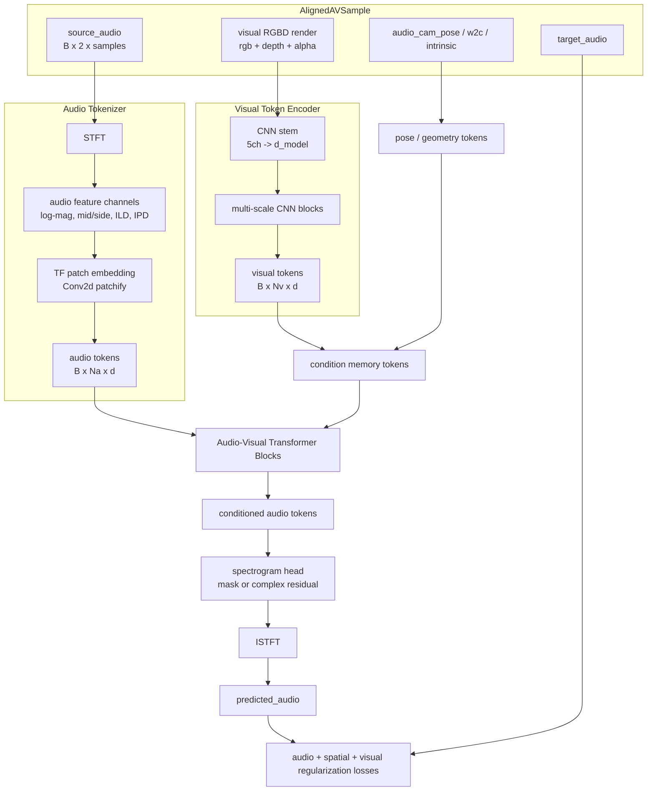
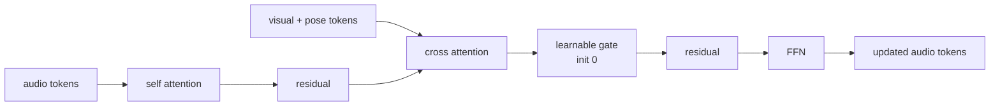

# Cross Attention 音频 Token 路线设计

本文记录 `codex/cross-attention-audio-tokens` 分支的实现方向：保留视觉端“CNN 先降维”的思路，但**不再沿用原 AudioGS renderer 中的 Audio U-Net**，而是把源音频变成 time-frequency tokens，再用 cross attention 接收视觉 RGBD tokens 和几何/位姿 tokens。

## 1. 为什么不直接在原 Audio U-Net 上加 Cross Attention

当前 `main` 的音频条件路径是：

```text
RGBD render -> RGBDConditionEncoder -> global embedding -> FiLM -> AudioGS U-Net
```

这条路适合作为第一版，因为 zero-init FiLM 可以保护 pretrained AudioGS。但最新 benchmark 的问题也很明显：主音频重建损失改善，而 LRE / 空间方向线索明显退化。原因之一可能是：

- 视觉条件被压成一个全局向量，空间结构丢失；
- FiLM 对 U-Net 多层做全局 scale/shift，条件很强但不够精细；
- 原 Audio U-Net 是二维时频卷积结构，适合局部 mask 预测，但不天然支持“音频 token 查询视觉 token”。

因此本分支目标不是给原 U-Net 打补丁，而是替换为：

```text
source audio -> STFT / mid-side / spatial cues -> audio tokens
RGBD -> CNN downsample -> visual tokens
audio tokens cross-attend visual tokens -> predict target audio spectrogram / masks
```

## 2. 总体架构草案



## 3. 音频如何变成 token

我建议第一版不要直接把 waveform 切成 token，而是用 **STFT time-frequency token**。原因：当前 AudioGS loss 和原 renderer 都围绕频谱/mono-diff 表达，STFT token 更容易对齐已有训练目标，也更容易解释空间音频退化。

### 3.1 输入音频表示

原始源音频：

```text
source_audio: B x 2 x T
```

先做 STFT：

```text
stft_L, stft_R: B x F x Tau complex
```

构造更适合空间音频的通道：

| 通道 | 含义 | 目的 |
|---|---|---|
| `log_mag_mid` | `(L + R) / 2` 的 log magnitude | 主体内容/响度 |
| `log_mag_side` | `(L - R) / 2` 的 log magnitude | 双耳差异 |
| `ild` | `log(|L| + eps) - log(|R| + eps)` | 左右能量差，直接约束空间线索 |
| `ipd_sin` | `sin(angle(L) - angle(R))` | 相位差的周期表示 |
| `ipd_cos` | `cos(angle(L) - angle(R))` | 相位差的周期表示 |
| `phase_mid_sin/cos` | mid phase 的 sin/cos，可选 | 支持 complex reconstruction |

第一版可以从 5 个音频通道开始：

```text
audio_features = [log_mag_mid, log_mag_side, ild, ipd_sin, ipd_cos]
shape: B x C_audio x F x Tau
```

这比直接用 `[L_real, L_imag, R_real, R_imag]` 更偏向空间音频任务，也能直接监控 LRE/ILD/IPD。

### 3.2 Patch embedding

使用二维 Conv patchify：

```text
Conv2d(C_audio, d_model, kernel_size=(freq_patch, time_patch), stride=(freq_patch, time_patch))
```

示例配置：

```text
n_fft = 512        -> F = 257
hop_length = 160
crop = 0.5s @ 16k -> T = 8000 samples -> Tau 大约 51
freq_patch = 8
time_patch = 4
token grid 约为 33 x 13 = 429 tokens
```

429 个 audio tokens 对自注意力偏多，但可以接受小模型试验；如果显存压力大，可以改为：

```text
freq_patch = 16
time_patch = 4
token grid 约为 17 x 13 = 221 tokens
```

每个 token 加：

- frequency positional embedding；
- time positional embedding；
- optional channel/type embedding；
- optional source/target-view pose embedding。

### 3.3 为什么不首选 waveform tokens

waveform tokens 路线类似：

```text
B x 2 x T -> Conv1d strided encoder -> B x N x d
```

但它有几个问题：

- 当前 loss 和指标大量在频谱域；
- 空间线索中的 ILD/IPD 在 STFT 域更直接；
- 0.5 秒音频如果用很小 stride，token 数量容易过大；
- 没有大规模音频预训练时，waveform tokenizer 更难学稳定。

因此第一版推荐 STFT token；waveform Conv tokenizer 可以作为后续 ablation。

## 4. 视觉 condition 如何变成 token

视觉输入仍然保留当前最有信息量的 5 通道：

```text
RGB 3 + normalized depth 1 + alpha/valid mask 1
```

但不再做 global average pooling 直接变成一个向量，而是输出低分辨率 spatial tokens：

```text
RGBD: B x 5 x H x W
CNN downsample -> B x d x Hv x Wv
flatten -> B x Nv x d
```

建议第一版目标 token 数：

```text
Nv = 6 x 10 到 12 x 21 之间
```

也就是先让 CNN 把 RGBD 降维，再把低分辨率 feature map flatten 成视觉 tokens。这样既保留空间布局，又避免 raw pixel attention 太重。

## 5. Pose / geometry tokens

只靠 RGBD 图像不够，尤其空间音频需要相机/听点几何。建议显式加入 pose tokens：

```text
audio_cam_pose: B x 12
visual_time: B x 1 x 1
optional camera center / forward vector / distance stats
```

用 MLP 投影成 1 到 4 个 tokens：

```text
pose_tokens = MLP(audio_cam_pose, visual_time, depth_stats)
shape: B x Np x d
```

最终 cross-attention memory：

```text
memory_tokens = concat(visual_tokens, pose_tokens)
```

## 6. Audio-Visual Transformer Block

第一版不要做太深，建议 4 到 6 层，每层：

```text
audio tokens
 -> pre-norm self-attention over audio tokens
 -> pre-norm cross-attention: Q=audio, K/V=visual+pose memory
 -> FFN
```

加 residual gate，初始接近 0：

```text
x = x + self_attn(x)
x = x + gate_cross * cross_attn(x, memory)
x = x + ffn(x)
```

`gate_cross` 初始为很小的非零值。当前严格协议固定为 `0.01`：它在限制初始扰动的同时，保证首步梯度能够到达 cross-attention、RGBD encoder 和深度路径。



## 7. 输出头：预测什么

有三种可选输出，推荐从 mask/residual 开始，而不是直接生成 waveform。

### 7.1 推荐第一版：预测 mid/side complex ratio mask

输入源音频 STFT 后，模型预测目标视角的 mid/side mask：

```text
mask_mid_mag, mask_side_mag, residual_ild, residual_ipd
```

然后重建目标 L/R 频谱并 ISTFT。

优点：

- 继承 AudioGS “源音频 -> 目标视角”的变换范式；
- 输出有物理含义；
- 更容易加入 ILD/IPD/LRE loss。

### 7.2 更简单版本：预测 L/R complex residual

```text
target_stft = source_stft + residual_stft
```

优点是实现简单；缺点是 residual 可能过自由，空间约束更难控制。

### 7.3 不建议第一版：直接预测 waveform

直接 waveform head 容量要求高，训练更不稳定，也更难解释 LRE 退化。

## 8. Loss 设计

仅优化 AudioGS 原始 `audio_total` 不够。Cross Attention 版本应显式加入空间音频项：

```text
loss =
    lambda_audio * audio_reconstruction_loss
  + lambda_mag * magnitude_loss
  + lambda_ild * ILD_loss
  + lambda_ipd * IPD_loss
  + lambda_lre * LRE_loss
  + lambda_rgb * visual_rgb_loss
  + lambda_anchor * visual_anchor_loss
  + lambda_gate * gate_regularization
```

第一版可先保守实现：

```text
audio_reconstruction_loss: waveform L1 + waveform MSE
ILD_loss: L1(log(|L_pred| + eps) - log(|R_pred| + eps), ILD_target)
IPD_loss: MSE(cos(IPD_pred), cos(IPD_target)) + MSE(sin(IPD_pred), sin(IPD_target))
LRE_loss: L1(10 * log10(E_left / E_right), target_lre_db)
gate_regularization: mean(abs(gate_cross)) 或 FiLM/attention residual norm
```

核心目标：让模型不能只靠牺牲方向线索来降低 `audio_total`。

## 9. 训练阶段建议

由于不再保留 Audio U-Net，训练策略需要重新定义：

### Stage A：Audio token transformer warm start

冻结 visual backend，只训练：

- audio tokenizer；
- audio transformer；
- cross-attention gates；
- output head；
- visual token encoder。

但 cross gate 初始为 0，先让模型学会不依赖视觉也能复现 native AudioGS 级别的源到目标变换。

### Stage B：打开 cross attention

逐步放大 cross gate，训练视觉 token encoder + cross attention + output head。

### Stage C：可选 joint visual fine-tune

最后才允许 audio loss 回传 visual Gaussian，并使用很低 visual LR + 更强 visual anchor / RGB guard。

## 10. 与现有代码的改造点

建议新增模块，而不是直接修改 `FiLMConditionedAudioUNet`：

```text
avgaussianv2/models/audio_tokens.py
    AudioSTFTTokenizer
    AudioPatchEmbed
    AudioSpectrogramHead

avgaussianv2/models/visual_tokens.py
    RGBDTokenEncoder
    PoseTokenEncoder

avgaussianv2/models/cross_attention_audio.py
    GatedCrossAttentionBlock
    AudioVisualTokenTransformer

avgaussianv2/backends/audio_token_transformer.py
    TokenAudioBackend
```

新的 backend 仍对外暴露同样接口：

```python
render(cam_pose, source_audio, condition_tokens=None) -> predicted_audio
```

这样 `AVGaussianFusionV2` 可以先最小改动升级为：

```text
visual.render_rgbd -> RGBDTokenEncoder -> visual_tokens
audio.render(cam_pose, source_audio, condition_tokens=visual_tokens)
```

后续再把 `condition_encoder` 从“输出 global embedding”泛化成“输出 condition object”：

```text
ConditionOutput(
    global_embedding: Tensor | None,
    visual_tokens: Tensor | None,
    pose_tokens: Tensor | None,
)
```

## 11. 第一版实现验收标准

单元测试应至少覆盖：

- STFT tokenizer 输入 `B x 2 x T`，输出有限 `B x Na x d` tokens；
- patch/depatch 后能恢复预期 spectrogram grid shape；
- cross attention block 在 gate=0 时近似 identity；
- visual tokens 与 pose tokens batch 对齐；
- output head 生成 `B x 2 x T` waveform；
- audio loss 能回传到 visual token encoder；
- 在关闭 cross gate 时，模型输出不依赖 RGBD tokens；
- 在打开 cross gate 时，输出随 RGBD tokens 改变。

## 12. 当前建议的第一版超参

```text
d_model = 128
audio_feature_channels = 5
freq_patch = 16
time_patch = 4
num_audio_tokens ≈ 200-250
visual_token_grid ≈ 8 x 12
num_layers = 4
num_heads = 4
ffn_multiplier = 4
cross_gate_init = 0.01
dropout = 0.0 or 0.05
```

## 13. 结论

本分支建议把音频 token 化建立在 STFT + mid/side + ILD/IPD 表达上，而不是直接 waveform token 或继续沿用 Audio U-Net。这样做更贴合当前问题：模型已经能降低主重建损失，但空间音频指标退化；显式 token 化空间线索，再让 audio tokens cross-attend visual/pose tokens，是比全局 FiLM 更有针对性的下一条路线。

## 14. 当前分支已落地入口

本分支已经新增一条可选训练入口，不影响默认 AudioGS/FiLM 路线：

```yaml
model:
  audio_backend: cross_attention_tokens
  embedding_dim: 128
  n_fft: 512
  hop_length: 160
  win_length: 400
  audio_freq_patch: 16
  audio_time_patch: 4
  audio_transformer_layers: 4
  audio_transformer_heads: 4
  audio_pose_tokens: 2
  audio_dropout: 0.0
  audio_loss_l1_weight: 1.0
  audio_loss_mse_weight: 0.1
  audio_loss_ild_weight: 0.1
  audio_loss_ipd_weight: 0.1
  audio_loss_lre_weight: 0.1
```

对应实现：

- `avgaussianv2/models/audio_tokens.py`：`AudioSTFTTokenizer` 与 `AudioSpectrogramHead`；
- `avgaussianv2/models/visual_tokens.py`：`RGBDTokenEncoder` 与 `PoseTokenEncoder`；
- `avgaussianv2/models/cross_attention_audio.py`：`GatedCrossAttentionBlock`、`AudioVisualTokenTransformer`、`AudioVisualTokenAudioBackend`；
- `avgaussianv2/cli/train.py`：当 `model.audio_backend = cross_attention_tokens` 时，使用 `RGBDTokenEncoder + AudioVisualTokenAudioBackend`，不加载旧 Audio U-Net renderer；
- `tests/test_cross_attention_audio_tokens.py`：覆盖 token shape、gate=0 identity、打开 gate 后 condition 梯度、waveform head、默认 criterion，以及 ILD/IPD/LRE 空间损失的可微性。

注意：当前第一版默认 loss 已经包含 `WaveformReconstructionLoss` 的 wave L1、wave MSE、ILD、IPD、LRE 五项。ILD/IPD/LRE 都在 STFT 域计算，目的是避免再次出现主重建指标变好但空间指标退化；后续仍建议用 benchmark 里的真实 LRE 定义校准这里的 `lre_loss` 权重。
