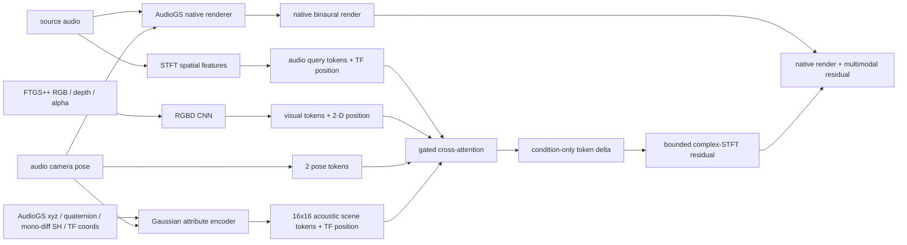

# AudioGS 原生 Cross-Attention 路线

## 目标边界

本分支比较两种 RGBD 条件后处理器，而不是比较两个无关的音频系统：

```text
FiLM:
AudioGS native_GS + (conditioned_U-Net - plain_U-Net)

Cross-attention:
AudioGS native_GS + cross_attention_delta(
    source_audio_tokens,
    [RGBD_tokens, pose_tokens, acoustic_Gaussian_tokens]
)
```

两者必须共享：

- `Audio3DGSMonoDiffGSOnly` checkpoint 与声学高斯初始化；
- AudioGS checkpoint 自带的 criterion；
- FTGS++ checkpoint；
- cam00–37 训练、cam38 测试；
- seed 42、batch size 1、2,000-step warmup、30,000-step main；
- 完全相同的有序训练样本索引和 5k/10k/30k 评估点。

两者只允许在 RGBD 条件后处理器及其参数量上不同。Cross-attention
运行时删除上游 AudioGS U-Net，避免误调用；但绝不能绕过 AudioGS 声学高斯。

## 数据流



query 音频 token 来自 source waveform。AudioGS 的 257×348=89,436 个声学点
不能直接作为注意力 memory；编码器先在原生时频拓扑上编码真实属性，再结构化
池化为 16×16=256 个场景 token。pose 既用于生成目标视角的高斯相对几何，
也保留两个全局 token，避免全局坐标信息在局部池化中丢失。

## 位置编码

- 音频：确定性的二维正弦编码，分别标识 frequency 和 time patch；
- 视觉：确定性的二维正弦编码，分别标识 row 和 column；
- 声学高斯：先保留 AudioGS 原生 frequency/time 坐标，再对 16×16 token
  添加确定性二维位置编码；
- memory 使用 visual/pose/acoustic 三类可学习模态编码；
- shuffled-RGBD 消融只打乱视觉内容，保留目标位置编码，用来检验模型是否依赖
  正确的空间对应关系。

位置编码必须满足同一网格内每个坐标唯一；测试需要覆盖同行异列、同列异行和
完整网格唯一性。

## 初始化与梯度

每个 cross-attention block 使用小的非零 cross gate（默认 `0.01`）。
后处理器解码的是：

```text
condition_delta = conditioned_source_tokens - source_tokens
```

spectrogram head 的 bias 为零，因此 gate 为零时严格恢复 AudioGS native
render；gate 为 `0.01` 时首步又能向 RGBD encoder、depth、cross-attention
权重传播非零梯度。这样同时满足预训练函数保护和首步可学习性。

warmup 阶段：

- 冻结 FTGS++ 和 AudioGS 声学高斯；
- 训练 RGBD token encoder、Gaussian token encoder、pose/audio tokenizer、
  cross-attention 和 residual head。

main 阶段按既有 joint protocol 解冻允许的参数组。

## 损失协议

Cross-attention 不定义另一套 waveform/ILD/IPD loss。它直接复用同一
AudioGS checkpoint 构造出的 criterion，避免“网络结构”和“训练目标”同时变化。
空间音频质量仍在统一评估协议中报告。

## 严格消融

同一个 cross-attention checkpoint 在每个评估点复用五次：

1. `cross_attention`：正常 RGBD；
2. `cross_attention_no_rgbd`：移除视觉 memory；
3. `cross_attention_shuffled_rgbd`：打乱 RGBD 内容但保留位置编码。
4. `cross_attention_no_gaussians`：移除显式声学高斯 memory；
5. `cross_attention_no_pose`：移除独立 pose memory。

这五组是同 checkpoint 的依赖性/因果诊断，不是重新训练后的容量消融。若完整
模型优于 FiLM+U-Net，再训练 no-RGBD 和 no-Gaussians 才能回答组件容量贡献。

主比较为 `cross_attention` 对 `joint_conditioned`（FiLM+U-Net）。报告同时给出
逐样本 paired delta 和 win rate，并明确参数量不同，不能把结果解释为单一
attention 算子的纯消融。

## 协议守卫

准备阶段必须同时验证 AudioGS 与 FTGS++ immutable native contracts，并拒绝：

- cross 配置除 `model.audio_backend` 外的任何原始 YAML 改动；
- 非 `Audio3DGSMonoDiffGSOnly` 模型；
- 任一 checkpoint 路径或 SHA-256 改动；
- split、样本顺序、seed、budget、batch size 或评估样本变化；
- causal 五组评估没有复用同一 checkpoint。

## 验证顺序

1. 单元测试：高斯主干、无 U-Net、位置唯一、首步梯度、checkpoint 兼容；
2. 两场景各做短程真实数据诊断，检查 finite loss、梯度、RGBD 因果差异和峰值显存；
3. 诊断收敛后启动 30k 长训练；
4. 在 5k/10k/30k 上对 cam38 统一评估；
5. 报告音频、视频指标以及五组同 checkpoint 因果消融。
