# AVGaussianV2 各版本架构图

本文用统一图例对比 AVGaussianV2 已实现和正式评估过的模型版本。图中的模块和
连接尽量对应实际代码，而不是只表达概念。

需要先区分：

- **分支不等于模型版本**：`cross-attention-run` 与
  `cross-attention-benchmark` 的代码树相同。
- **同架构也可以是不同实验系统**：Native AudioGS 与 GS-only 30k 的推理
  架构相同，只是 checkpoint 和 continuation 状态不同。
- **训练目标可以变化而推理架构不变**：P1 与 Spatial P1 的推理数据流完全
  相同，只在训练 loss 上不同。

## 1. 统一图例

所有图使用相同语义：

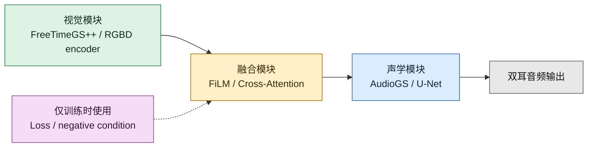

- 绿色：视觉场、RGBD 或几何视觉表示。
- 蓝色：AudioGS、声学 Gaussian、U-Net 和音频合成。
- 黄色：视觉和音频发生交互的位置。
- 紫色虚线：只在训练时使用，不改变推理架构。
- 灰色：最终输出。

## 2. 一张图看完所有路线

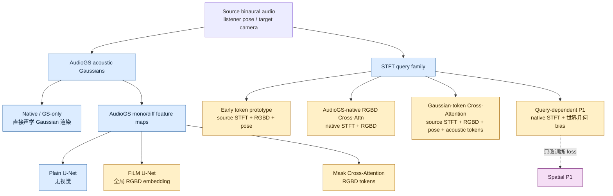

从左到右，核心变化是：

1. 是否使用 AudioGS U-Net；
2. 视觉条件是一个全局向量、普通 token，还是带三维几何的 memory；
3. 融合发生在 U-Net feature、AudioGS mask，还是 complex STFT residual；
4. 输出是否保留 native AudioGS 作为残差锚点。

## 3. 共同的视觉输入

除 Native、GS-only 和 Plain U-Net 外，其他版本都从同一目标相机和时间渲染
视觉条件：

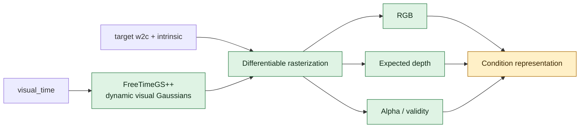

不同版本从 `Condition representation` 开始分叉：

| 版本 | 视觉表示 |
|---|---|
| FiLM / Direct / Gated | 一个全局 128 维 RGBD embedding |
| Early codex token | RGBD tokens，无显式二维位置编码 |
| AudioGS-native / Gaussian-token / Mask Cross-Attention | 带二维位置编码的 RGBD tokens |
| P1 / Spatial P1 | RGBD + camera/world XYZ + normal + alpha 的几何 memory |

## 4. Native AudioGS / GS-only 30k

Native AudioGS 与 GS-only 30k 使用相同推理结构。区别只是 Native 是原生
checkpoint，GS-only 是在统一协议下继续训练 30k updates。

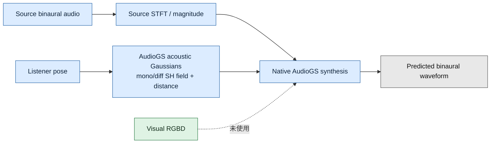

关键点：

- 没有视觉输入。
- GS-only checkpoint 的实际 forward 绕过继承的 U-Net renderer。
- 它是所有条件模型的 native 声学锚点和空间指标基线。

## 5. Plain U-Net

Plain U-Net 使用 AudioGS 原有 mono/diff U-Net，但不输入视觉条件。

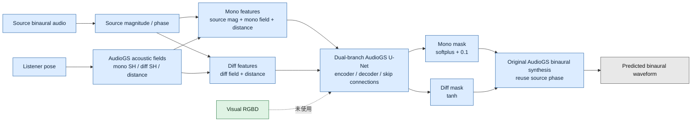

与 GS-only 的区别：它真正调用 U-Net 生成 mono/diff masks。与 FiLM 的区别：
U-Net 内没有视觉调制。

## 6. FiLM native residual

FiLM 是基础 AVGaussianV2 的主要结构。视觉 RGBD 被压缩为一个全局 embedding，
在 U-Net 的 8 个 encoder/decoder block 后执行 channel-wise scale/shift。

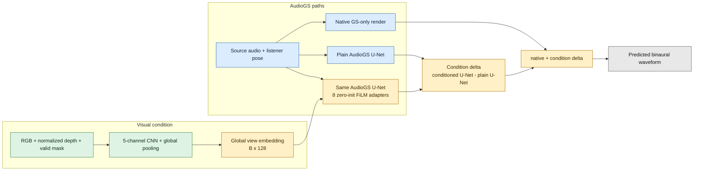

公式：

```text
output = native_AudioGS
       + conditioned_U-Net(RGBD)
       - plain_U-Net
```

这样 FiLM 初始化为零时，输出严格退化为 native AudioGS，不会在训练开始时让
随机条件分支接管完整音频。

## 7. Direct conditioned U-Net

Direct 版本保留相同 RGBD encoder 和 FiLM U-Net，但移除 native residual
组合，直接让 conditioned U-Net 负责完整输出。

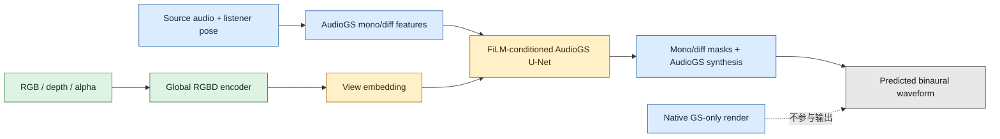

公式：

```text
output = conditioned_U-Net(RGBD)
```

它同时改变了视觉条件和输出锚定方式，所以不能单独用它估计 RGBD 的因果贡献。

## 8. Gated native residual

Gated 版本与 FiLM 完全相同，只在 condition delta 外增加一个可学习的全局标量
gate，初始化为 1，范围限制在 `(0, 2)`。

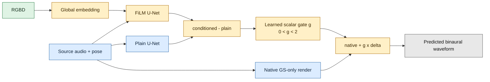

公式：

```text
output = native_AudioGS + g * (conditioned_U-Net - plain_U-Net)
```

一个全局 gate 只能整体控制视觉修正强度，不能区分不同频率、时间和
mono/diff 区域。

## 9. Early codex audio-token prototype

这是 `codex/cross-attention-audio-tokens` 最早实现的独立原型。它不加载
AudioGS checkpoint，也没有 native AudioGS anchor；AudioGS 在这里仅体现在项目
背景和 pose 定义中。

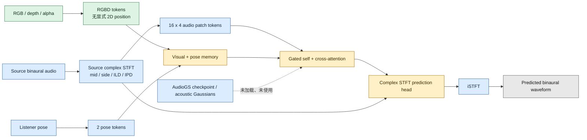

它使用自定义 waveform + ILD/IPD/LRE loss，没有进入后续严格 AudioGS criterion
和 cam38 正式比较，因此应视为结构验证原型。

## 10. AudioGS-native RGBD Cross-Attention

正式 `cross-attention-benchmark` 的初版先解决“必须从真实 AudioGS Gaussian
预测出发”的问题。它移除 AudioGS U-Net，以 native AudioGS waveform 的 STFT
作为 query 和 residual anchor，只查询 RGBD tokens。

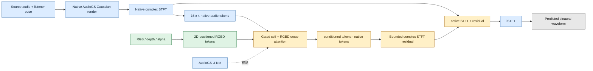

这一步已经使用真实 AudioGS 输出，但 cross-attention memory 仍只有 RGBD，没有
显式 pose token 或 acoustic-Gaussian attribute token。

## 11. Gaussian-token complex Cross-Attention

这个版本完全移除上游 AudioGS U-Net。它让 source-audio STFT patch token
查询三类 memory：RGBD tokens、listener pose tokens 和显式 AudioGS Gaussian
attribute tokens。

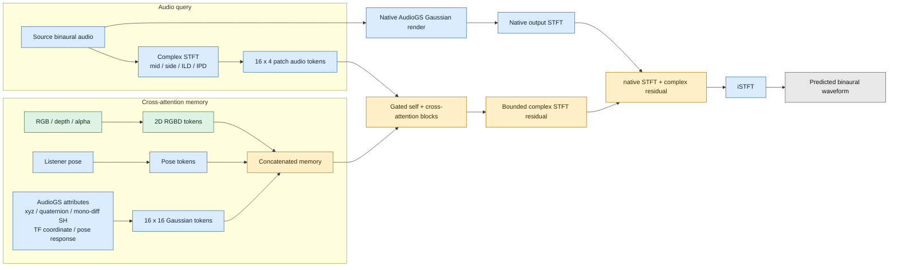

关键区别：

- AudioGS U-Net 完全不参与。
- 显式看到声学 Gaussian 属性，但视觉只是一组普通二维 tokens。
- 输出是 complex spectrogram residual，不是 AudioGS mono/diff masks。

## 12. AudioGS mask-protocol Cross-Attention

Mask 版本把 cross-attention 放回 AudioGS renderer 的标准位置：输入是原始
mono/diff feature maps，输出仍是 mono/diff masks。

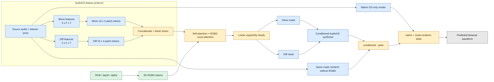

相对 Gaussian-token 版本，它恢复了 AudioGS 的输入输出协议和双耳合成算法；
相对 FiLM，它用从头训练的 patch transformer 替代带局部卷积和 skip
connection 的 U-Net。

## 13. Query-dependent P1

P1 的重点不是增加更多 token，而是显式建立“某个音频时频 query 应该关注哪个
三维视觉位置”的 listener-relative 几何关系。

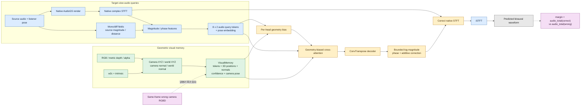

几何 bias 同时使用：

- listener 到 visual point 的距离和方向；
- listener/head 坐标中的方向和法向；
- surface facing；
- condition camera 与 listener 的相对位置和朝向；
- 视觉相机 view direction 与 listener direction 的 parallax；
- 音频 query 的频率和时间坐标。

与前两种 cross-attention 最大的区别是：P1 的 attention score 显式依赖目标
listener、condition camera 和每个三维 visual point 的相对几何。

## 14. Spatial P1

Spatial P1 与 P1 的**推理图完全相同**。它只替换训练时的 camera-contrast
目标。

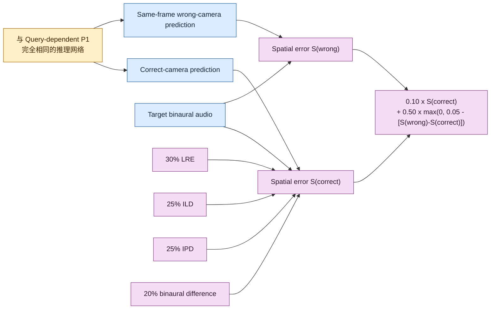

原 P1 使用：

```text
max(0, margin + audio_total(correct) - audio_total(wrong))
```

Spatial P1 使用：

```text
S = 0.30 LRE + 0.25 ILD + 0.25 IPD + 0.20 binaural_difference

loss = 0.10 S(correct)
     + 0.50 max(0, 0.05 - [S(wrong) - S(correct)])
```

所以 Spatial P1 不是“新模型”，而是同一个 P1 模型在不同监督信号下得到的
checkpoint。

## 15. Visual-only

Visual-only 是 benchmark 对照，不产生音频。它只更新 FreeTimeGS++ 视觉场，
用于判断联合音频训练是否损害视觉质量。

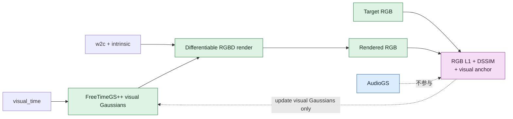

它与 Native FreeTimeGS++ 也是同架构、不同训练状态的关系。

## 16. 差异矩阵

| 版本 | 视觉条件 | AudioGS U-Net | 融合位置 | 输出形式 | Native anchor |
|---|---|---|---|---|---|
| Native / GS-only | 无 | 不使用 | 无 | Native waveform | 自身 |
| Plain U-Net | 无 | 使用 | 无 | U-Net masks -> waveform | 无 |
| FiLM | 全局 embedding | 使用 | 8 个 U-Net block | U-Net condition delta | 有 |
| Direct | 全局 embedding | 使用 | 8 个 U-Net block | Conditioned U-Net waveform | 无 |
| Gated | 全局 embedding | 使用 | 8 个 U-Net block | Scalar-gated condition delta | 有 |
| Early codex token | 2D RGBD tokens + pose | 不加载 | Source-STFT token transformer | Complex STFT prediction | 无 |
| AudioGS-native RGBD | 2D RGBD tokens | 移除 | Native-STFT token transformer | Complex STFT residual | 有 |
| Gaussian-token | 2D tokens + pose + acoustic tokens | 移除 | STFT token transformer | Complex STFT residual | 有 |
| Mask Cross-Attn | 2D RGBD tokens | 替换为 transformer | AudioGS mask renderer | Mono/diff mask delta | 有 |
| P1 | 3D geometric VisualMemory | 不使用 | Geometry-biased STFT attention | Magnitude/phase/additive residual | 有 |
| Spatial P1 | 与 P1 相同 | 与 P1 相同 | 与 P1 相同 | 与 P1 相同 | 有 |
| Visual-only | 不适用 | 不参与 | 无 | RGBD only | 不适用 |

## 17. 如何直观看这些差异

最关键的三条观察：

1. **FiLM、Direct、Gated 是同一个 U-Net family。**
   它们主要区别在输出怎么与 native AudioGS 合成，不是三个完全不同的 backbone。
2. **Cross-Attention 经历了三次关键修正。**
   早期原型没有 AudioGS；native RGBD 版加入 AudioGS anchor；Gaussian-token
   版再加入显式 pose 和 acoustic Gaussian memory。
3. **Gaussian-token 与 Mask Cross-Attention 不是同一种输出协议。**
   前者直接预测 complex STFT residual；后者预测 AudioGS mono/diff masks。
4. **P1 真正新增的是 query-dependent 三维对应。**
   Spatial P1 没有继续增加结构，只修改了 correct/wrong-camera 的训练目标。

结合实验结果，当前结构演进可以概括为：

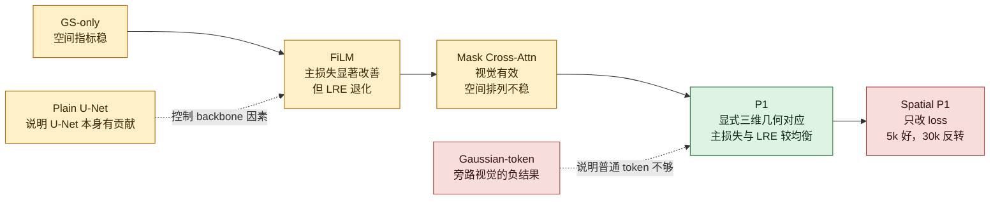

## 18. 对应代码

| 架构部分 | 代码位置 |
|---|---|
| 顶层视觉 -> 条件 -> 音频前向 | `avgaussianv2/models/fusion.py` |
| Native / FiLM / Direct / Gated 组合 | `avgaussianv2/backends/audio_audiogs.py` |
| FiLM U-Net | `avgaussianv2/models/film_unet.py` |
| RGBD global encoder | `avgaussianv2/models/rgbd.py` |
| 2D RGBD token encoder | `avgaussianv2/models/visual_tokens.py` |
| Early token prototype | `origin/codex/cross-attention-audio-tokens:avgaussianv2/models/cross_attention_audio.py` |
| AudioGS-native RGBD Cross-Attention | `origin/agent/cross-attention-benchmark:avgaussianv2/models/cross_attention_audio.py` |
| Gaussian-token Cross-Attention | `avgaussianv2/models/cross_attention_audio.py` |
| AudioGS Gaussian token schema | `avgaussianv2/models/acoustic_gaussian_tokens.py` |
| Mask Cross-Attention | `avgaussianv2/models/mask_cross_attention.py` |
| P1 audio queries / geometry bias | `avgaussianv2/models/p1_audio.py` |
| P1 geometric VisualMemory | `avgaussianv2/models/p1_visual.py` |
| P1 camera-contrast training objective | `avgaussianv2/train.py` |
| Spatial P1 historical objective | `origin/agent/p1-spatial-camera-contrast:avgaussianv2/train.py` |

本文只画已经在当前实验矩阵中实现或评估的版本。LRE-anchor 等后续诊断配置是
输出后处理消融，不作为一个新的基础架构重复绘制。
